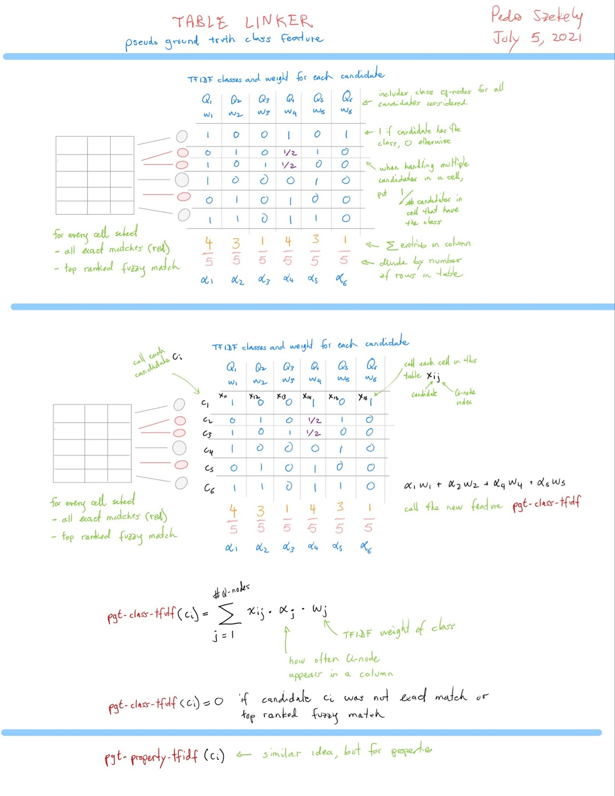

[](https://coveralls.io/github/usc-isi-i2/table-linker)


# [« Home](https://github.com/usc-isi-i2/table-linker) / Command Line Interface

Table-Linker: this is an entity linkage tool which links the given string to wikidata Q nodes.
This document describes the command-line interface for the <code>Table Linker (tl)</code> system.


## Installation Instructions

Run the following commands in order in a terminal,
```
git clone https://github.com/usc-isi-i2/table-linker
cd table-linker

python3 -m venv tl_env
source tl_env/bin/activate
pip install -r requirements.txt

pip install -e .
```
If python3 is not installed, find out what version of python 3 is installed and use that instead.

### Alternatively, install using pip

```
python3 -m venv tl_env
source tl_env/bin/activate

pip install table-linker
```

## Install via Docker

```
git clone https://github.com/usc-isi-i2/table-linker
cd table-linker
```

1. Build the Docker image
```
docker build -t table-linker .
```
2. Run Docker container
```
docker run \
  -v <local path on host machine with files to wikify>:/data  \
  -it -p 3322:3322 table-linker \
  /bin/bash -c "jupyter lab --ip='*' --port=3322 --allow-root --no-browser --notebook-dir /table-linker/notebooks"
```

## Pipelines
The `tl` CLI works by pushing CSV data through a series of commands, starting with a single input on `stdin` and ending with a single output on `stdout`. This pipeline feature allows construction of pipelines for linking table cells to a knowledge graph (KG).

### `Usage:  tl [OPTIONS] COMMAND [ / COMMAND]* `

**Table of Contents:**
- [`add-color`](#command_add-color)<sup>*</sup>: Add some color on the specified score columns for better visualization.
- [`add-text-embedding-feature`](#command_add-text-embedding-feature)<sup>*</sup>: computes text embedding vectors of the candidates and similarity to rank candidates.
- [`align-page-rank`](#command_align-page-rank)<sup>*</sup>: computes aligned page rank (exact-match candidates retain its pagerank as is, fuzzy-match candidates receive 0 for page rank).
- [`canonicalize`](#command_canonicalize)<sup>*</sup>: translate an input CSV or TSV file to [canonical form](https://docs.google.com/document/d/1eYoS47dCryh8XKjWIey7khikkbggvc6IUkdUGrQ9pEQ/edit#heading=h.wn7c3l1ngi5z)
- [`check-candidates`](#command_check-candidates)<sup>*</sup>: displays those rows for which the ground truth was never retrieved as a candidate.
- [`check-extra-information`](#command_check-extra-information)<sup>*</sup> : Check if the given extra information exists in the given kg node and corresponding wikipedia page (if exists).
- [`clean`](#command_clean)<sup>*</sup> : clean the values to be linked to the KG.
- [`combine-linearly`](#command_combine-linearly)<sup>*</sup>: linearly combines two or more columns with scores for candidate knowledge graph objects for each input cell value.
- [`compute-tf-idf`](#command_compute-tf-idf)<sup>*</sup>: compute the "tf-idf" like score base on the candidates. It is not the real tf-idf score algorithm but using a algorithm similar to tf-idf score.
- [`context-match`](#command_context-match)<sup>*</sup>: matches the values present as the context to the properties of the candidate and calculates the score based on the properties matched for each candidate.
- [`create-pseudo-gt`](#command_create-pseudo-gt)<sup>*</sup>: generates a boolean feature indicating if candidate is part of the pseudo ground truth or not.
- [`create-singleton-feature`](#command_create-singleton-feature)<sup>*</sup>: generates a boolean feature for exact match singletons
- [`drop-by-score`](#command_drop-by-score)<sup>*</sup>: Remove rows of each candidates according to specified score column from higher to lower.
- [`drop-duplicate`](#command_drop-duplicate)<sup>*</sup>: Remove duplicate rows of each candidates according to specified column and keep the one with higher score on specified column.
- [`feature-voting`](#command_feature-voting)<sup>*</sup>: Perform voting on user specified feature column, for instance smallest_qnode_score, pagerank etc.
- [`generate-reciprocal-rank`](#command_generate-reciprocal-rank)<sup>*</sup>: Generates a new feature reciprocal rank based on a scoring column provided as input by the user.
- [`get-exact-matches`](#command_get-exact-matches)<sup>*</sup>: retrieves the identifiers of KG entities whose label or aliases match the input values exactly.
- [`get-fuzzy-matches`](#command_get-fuzzy-matches)<sup>*</sup>: retrieves the identifiers of KG entities whose label or aliases base on the elastic search fuzzy match.
- [`get-fuzzy-augmented-matches`](#command_get-fuzzy-augmented-matches)<sup>*</sup>: retrieves the identifiers of KG entities from an elasticsearch index. It does fuzzy search over multilingual labels, aliases, wikipedia and wikitable anchor text and wikipedia redirects.
- [`get-phrase-matches`](#command_get-phrase-matches)<sup>*</sup>: retrieves the identifiers of KG entities whose label or aliases base on the elastic search phrase match.
- [`get-kgtk-search-matches`](#command_get-kgtk-search-matches)<sup>*</sup>: uses KGTK search API to retrieve identifiers of KG entities matching the input search term.
- [`get-kg-links`](#command_get-kg-links): outputs the top `k` candidates from a sorted list as linked knowledge graph objects for an input cell in [KG Links](https://docs.google.com/document/d/1eYoS47dCryh8XKjWIey7khikkbggvc6IUkdUGrQ9pEQ/edit#heading=h.ysslih9i88l5) format.
- [`ground-truth-labeler`](#command_ground-truth-labeler)<sup>*</sup>: compares each candidate for the input cells with the ground truth value for that cell and adds an evaluation label
- [`join`](#command_join): The join command outputs the linked knowledge graph objects for an input cell. This command takes as input a Input file and a file in Ranking Score format and outputs a file in [Output](https://docs.google.com/document/d/1eYoS47dCryh8XKjWIey7khikkbggvc6IUkdUGrQ9pEQ/edit#heading=h.6rlemqh56vyi) format
- [`merge-columns`](#command_merge-columns): merges values from two or more columns and outputs the concatenated value in the output column
- [`metrics`](#command_metrics)<sup>*</sup>: Calculate the F1-score on the candidates tables. Only works on the dataset after ran with  `ground-truth-labeler`.
- [`mosaic-features`](#command_mosaic-features)<sup>*</sup>: Computes general features which are number of characters, number of tokens for each cell present in a specified column.
- [`normalize-scores`](#command_normalize-scores)<sup>*</sup>: normalizes the retrieval scores for all the candidate knowledge graph objects for each retrieval method for all input cells.
- [`plot-score-figure`](#command_plot-score-figure)<sup>*</sup>: visulize the score of the input data with 2 different kind of bar charts.
- [`predict-using-model`](#command_predict-using-model)<sup>*</sup>: Use trained contrastive loss neural network for final prediction 
- [`score-using-embedding`](#command_score-using-embedding)<sup>*</sup>: Score candidates using pre-computed embedding vectors
- [`smallest-qnode-number`](#command_smallest-qnode-number)<sup>*</sup>: Add a feature column called smallest_qnode_number where candidates with smallest qnode number receives 1 for this feature while others receive 0.
- [`run-pipeline`](#command_run-pipeline)<sup>*</sup>: runs a pipeline on a collection of files to produce a single CSV file with the results for all the files.
- [`string-similarity`](#command_string-similarity)<sup>*</sup>: compares the cell values in two input columns and outputs a similarity score for each pair of participating strings
- [`tee`](#command_tee)<sup>*</sup>: saves the input to disk and echoes the input to the standard output without modification.
- [`vote-by-classifier`](#command_vote-by-classifier) <sup>*</sup>: generates vote_by_model column as specified classifier's prediction output.
- [`pgt-semantic-tf-idf`](#command_pgt-semantic-tf-idf) <sup>*</sup>: Identify pseudo GT and then compute tf-idf score using semantic features in the pseudo GT.
- [`pick-hc-candidates`](#command_pick-hc-candidates) <sup>*</sup>: Identify high confidence candidates based on string similarity and number of candidates with same string similarity.
- [`kth-percentile`](#command_kth-precentile) <sup>*</sup>: Label the top kth percentile candidates for a column.


**Note: only the commands marked with <sup>*</sup> are currently implemented**

**Options:**
- `-e, --examples` -- Print some examples and exit
- `-h, --help` -- Print this help message and exit
- `-v, --version` -- Print the version info and exit
- `--url {url}`:  URL of the Elasticsearch server containing the items in the KG
- `--index {index}`: name of the Elasticsearch index
- `-U {user id}`: the user id for authenticating to the ElasticSearch index
- `-P {password}`: the password for authenticating to the ElasticSearch index
- `--tee {directory}`: directory path for saving outputs of all pipeline stages
- `--log-file {path_to_file}`: file path for saving additional info about execution of command

## Common Options
These are options that can appear in different commands. We list them here so that options with the same meaning use the same character.

- `-c`: specifies columns to operate on. Columns can be specified using column headers or indices; indices are zero-based; multiple columns are comma-separated.
- `-o`: specifies the output column of a command.
- `-p`: specifies names of properties in the KG
- `--url {url}`:  URL of the ElasticSearch index containing the items in the KG.
- `-U {user id}`: the user id for authenticating to the ElasticSearch index.
- `-P {password}`: the password for authenticating to the ElasticSearch index.
- `-i`: case insensitive operation.
- `-n {number}`: controls the number of items processed, e.g., the number of candidates retrieved during candidate generation.
- `-f {path}`: specifies auxiliary file path as input to commands

## Error handling
In case of an error in any of the commands in the `tl` pipeline, the responsible command will print out
the error details, an error code and, the pipeline will halt.

**Error details**

Error details will contain the following information
- `name of the command`: the command where this error occurred
- `error message`: a stacktrace of the error message describing the exception
- `error code`: a number corresponding to the error. Default is `-1`

**Example**
```bash
Command: get-exact-matches
Error Message:
 Traceback (most recent call last):
  File "get_candidates.py", line 7, in <module>
    raise HTTPUnAuthorizedError(msg)
  HTTP 403: Unauthorized attempt to connect to Elasticsearch
Error Code: 403
```

## Commands On Raw Input Files

<a name="command_canonicalize" />

### [`canonicalize`](#command_canonicalize)` [OPTIONS]`
translate an input CSV or TSV file to [canonical form](https://docs.google.com/document/d/1eYoS47dCryh8XKjWIey7khikkbggvc6IUkdUGrQ9pEQ/edit#heading=h.wn7c3l1ngi5z)

**Options:**
- `-c {a,b,...}`: the columns in the input file to be linked to KG entities. Multiple columns are specified as a comma separated string.
- `-o a`: specifies the name of a new column to be added. Default output column name is `label`
- `--tsv`:  the delimiter of the input file is TAB.
- `--csv`: the delimiter of the input file is comma.
- `--add-context`: if provided, the information from other columns will be combined together and saved
                             to the column: `context`, separated by `|`

**Examples:**
   ```bash
   # Build a canonical file to link the 'people' and 'country' columns in the input file
   $ tl canonicalize -c people,country < input.csv > canonical-input.csv
   $ cat input.csv | tl canonicalize -c people,country > canonical-input.csv

   # Same, but using column as index to specify the country column
   $ tl canonicalize -c people,3 < input.csv > canonical-input.csv
   ```

**File Example:**
```bash
# Consider the following input file,
$ cat countries.csv

country        capital_city phone_code
Hungary        Buda’pest    +49
Czech Republic Prague       +420
United Kingdom London!      +44

# canonicalize the input file and process columns country and capital_city
$ tl canonicalize -c capital_city --csv countries.csv > countries_canonical.csv
$ cat countries_canonical.csv

column row label
1      0   Buda’pest
1      1   Prague
1      2   London!

$ cat chief_subset.tsv

col0  col1  col2
Russia  Pres. Vladimir Vladimirovich PUTIN
Russia  Premier Dmitriy Anatolyevich MEDVEDEV
Russia  First Dep. Premier  Anton Germanovich SILUANOV
Russia  Dep. Premier  Maksim Alekseyevich AKIMOV
Russia  Dep. Premier  Yuriy Ivanovich BORISOV
Russia  Dep. Premier  Konstatin Anatolyevich CHUYCHENKO
Russia  Dep. Premier  Tatyana Alekseyevna GOLIKOVA

# canonicalize the input file and process col2 with adding extra information
$ tl canonicalize -c col2  --add-context chief_subset.tsv > organizations_subset_col0_canonicalized.csv

# note that we get an extra column here, which is the information from the input file, combined by `|`
$ cat organizations_subset_col0_canonicalized.csv

column,row,label,context
2,0,Vladimir Vladimirovich PUTIN,Russia|Pres.
2,1,Dmitriy Anatolyevich MEDVEDEV,Russia|Premier
2,2,Anton Germanovich SILUANOV,Russia|First Dep. Premier
2,3,Maksim Alekseyevich AKIMOV,Russia|Dep. Premier
2,4,Yuriy Ivanovich BORISOV,Russia|Dep. Premier
2,5,Konstatin Anatolyevich CHUYCHENKO,Russia|Dep. Premier
2,6,Tatyana Alekseyevna GOLIKOVA,Russia|Dep. Premier
```

### Implementation
Assign zero based indices to the input columns and corresponding rows.
The columns are indexed from left to right and rows from top to bottom. The first row is column header, the first data row is
assigned index 0.

## Commands On Canonical Files
[Canonical Cell files](https://docs.google.com/document/d/1eYoS47dCryh8XKjWIey7khikkbggvc6IUkdUGrQ9pEQ/edit#heading=h.wn7c3l1ngi5z) contain one row per cell to be linked.

<a name="command_clean" />

### [`clean`](#command_clean)` [OPTIONS]`
The `clean` command cleans the cell values in a column, creating a new column with the clean values.
 The `clean` command performs two types of cleaning:

- Invokes the [ftfy](https://pypi.org/project/ftfy/) library to fix broken unicode characters and html tags.
- Removes or replaces symbols by space.

The `clean` command produces a file in the [Canonical Cells](https://docs.google.com/document/d/1eYoS47dCryh8XKjWIey7khikkbggvc6IUkdUGrQ9pEQ/edit#heading=h.wn7c3l1ngi5z) format

**Options:**
- `-c a`: the column to be cleaned.
- `-o a`: the name of the column where cleaned column values are stored. If not provided, the name of the new column is the name of the input column with the suffix `_clean`.
- `--symbols {string}`: a string containing the set of characters to be removed: default is “!@#$%^&*()+={}[]:;’\”/<>”
- `--replace-by-space {yes/no}`: when `yes` (default) all instances of the symbols are replaced by a space. In case of removal of multiple consecutive characters, they’ll be replaced by a single space. The value `no` causes the symbols to be deleted.
- `--keep-original {yes/no}` : when `yes`, the output column will contain the original value and the clean value will be appended, separated by `|`. Default is `no`

**Examples:**
```bash
   # Clean the values in column 'label' using the default settings,
   # creating a column 'label_clean' with the clean values.
   $ tl clean -c label < canonical-input.csv

   # Remove all types of parenthesis from the label.
   $ tl clean -c label -o clean --symbols "(){}[]" --replace-by-space no < canonical-input.csv

    # Clean the values in column 'label', output column 'clean_labels', keeping the original values
    $ tl clean -c label -o clean_labels --keep-original yes canonical_input.csv
```

**File Example:**
```bash
# Consider the canonical file, countries_canonical.csv
$ cat countries_canonical.csv

column row label
1      0   Buda’pest
1      1   Prague
1      2   London!

# clean the column label and delete the default characters
$ tl clean -c label -o clean_labels --replace-by-space no countries_canonical.csv

column row label          clean_labels
1      0   Buda’pest      Budapest
1      1   Prague         Prague
1      2   London!        London
```


## Candidate Generation Commands
Candidate Generation commands use external indices or APIs to retrieve candidate links for cells in a column. `tl` supports several strategies for generating candidates.

All candidate generation commands take a column in a [Canonical Cells](https://docs.google.com/document/d/1eYoS47dCryh8XKjWIey7khikkbggvc6IUkdUGrQ9pEQ/edit#heading=h.wn7c3l1ngi5z) file as input and
 produce a set of KG identifiers for each row in a canonical file and candidates are stored one per row. A `method` column records the name of the strategy that produced a candidate.

When a cell contains a |-separated string (e.g., `Pedro|Peter`, the string is split by `|` and candidates are fetched for each of the resulting values.

Candidate Generation commands output a file in [Candidates](https://docs.google.com/document/d/1eYoS47dCryh8XKjWIey7khikkbggvc6IUkdUGrQ9pEQ/edit#heading=h.j9cdkygbzzq7) format


<a name="command_get-exact-matches" />

### [`get-exact-matches`](#command_get-exact-matches)` [OPTIONS]`
This command retrieves the identifiers of KG entities whose label or aliases match the input values exactly.

**Options:**
- `-c a`: the column used for retrieving candidates.
- `-i`: case insensitive retrieval, default is case sensitive.
- `-n {number}`: maximum number of candidates to retrieve, default is 50.
- `-o /--output-column {string}`:  Set a speicifc output column name can help to make split scoring columns for different match methods. If not given, in default all matching methods' scores will in one column.
- `--auxiliary-fields`: A comma separated string of auxiliary field names in the elasticsearch. A file will be created for each of the specified field at the location specified by the `--auxiliary-folder` option. If this option is specified then, `--auxiliary-folder` must also be specified.
- `--auxiliary-folder`: location where the auxiliary files for auxiliary fields will be stored. If this option is specified then `--auxiliary-fields` must also be specified.

This command will add the column `kg_labels` to record the labels and aliases of the candidate knowledge graph object. In case of missing
labels or aliases, an empty string "" is recorded. A `|` separated string represents multiple labels and aliases.
The values to be added in the  column `kg_labels` are retrieved from the Elasticsearch index based on the `-p` option as
defined above.

This command will also add the column `kg_descriptions` to record english descriptions of the candidate knowledge graph object. In case of missing 
description, an empty string "" is recorded. A '|' separated string represents multiple english descriptions.

The string `exact-match` is recorded in the column `method` to indicate the source of the candidates.

The Elasticsearch queries return a score which is recorded in the column `retrieval_score`. The scores are stored in
the field `_score` in the retrieved Elasticsearch objects.

The identifiers for the candidate knowledge graph objects returned by Elasticsearch are recorded in the column `kg_id`. The identifiers
 are stored in the field `_id` in the retrieved Elasticsearch objects.

**Examples:**

```bash
   # generate candidates for the cells in the column 'label_clean'
   $ tl --url http://blah.com --index kg_labels_1 -Ujohn -Ppwd  get-exact-matches -c label_clean  < canonical-input.csv

   # clean the column 'label' and then generate candidates for the resulting column 'label_clean' with case insensitive matching
   $ tl --url http://blah.com --index kg_labels_1 -Ujohn -Ppwd clean -c label / get-exact-matches -c label_clean -i  < canonical-input.csv

```

**File Example:**

```
# generate candidates for the canonical file, countries_canonical.csv
$ tl --url http://blah.com --index kg_labels_1 -Ujohn -Ppwd  get-exact-matches -c clean_labels  < countries_canonical.csv > countries_candidates.csv
$ cat countries_candidates.csv

column row label     clean_labels kg_id     kg_labels                             method      retrieval_score
1      0   Buda’pest Budapest     Q1781     Budapest|Buda Pest|Buda-Pest|Buda     exact-match 15.43
1      0   Buda’pest Budapest     Q16467392 Budapest (chanson)                    exact-match 14.07
1      0   Buda’pest Budapest     Q55420238 Budapest|Budapest, a song             exact-match 13.33
1      1   Prague    Prague       Q1085     Prague|Praha|Praha|Hlavní město Praha exact-match 15.39
1      1   Prague    Prague       Q1953283  Prague, Oklahoma                      exact-match 14.44
1      1   Prague    Prague       Q2084234  Prague, Nebraska                      exact-match 13.99
1      1   Prague    Prague       Q5969542  Prague                                exact-match 14.88
1      2   London!   London       Q84       London|London, UK|London, England     exact-match 13.88
1      2   London!   London       Q92561    London ON                             exact-match 12.32
```

### Implementation

The `get-exact-matches` command will be implemented using an ElasticSearch index built using an Edges file in KGTK format.
Two ElasticSearch term queries are defined, one for exact match retrieval and one for case-insensitive exact match retrieval.

-   Exact match query: In Elasticsearch language, this will be a terms query. Terms query allows search for multiple terms. This query retrieves documents which have the exact search term as label or aliases.
-   Exact match lowercase query: Same as Exact match query but with lowercase search terms.

<a name="command_get-phrase-matches" />

### [`get-phrase-matches`](#command_get-phrase-matches)` [OPTIONS]`
retrieves the identifiers of KG entities base on phrase match queries.

**Options:**
- `-c a`: the column used for retrieving candidates.
- `-p {a,b,c}`:  a comma separated names of properties in the KG to search for phrase match query with boost for each property.
 Boost is specified as a number appended to the property name with a caret(^). default is `labels^2,aliases`.
- `-n {number}`: maximum number of candidates to retrieve, default is 50.
- `--filter {str}`: a string indicate the filtering requirement.
- `-o /--output-column {string}`:  Set a speicifc output column name can help to make split scoring columns for different match methods. If not given, in default all matching methods' scores will in one column.

This command will add the column `kg_labels` to record the labels and aliases of the candidate knowledge graph object. In case of missing
labels or aliases, an empty string "" is recorded. A `|` separated string represents multiple labels and aliases.
The values to be added in the  column `kg_labels` are retrieved from the Elasticsearch index based on the `-p` option as
defined above.

The string `phrase-match` is recorded in the column `method` to indicate the source of the candidates.

The Elasticsearch queries return a score which is recorded in the column `retrieval_score`. The scores are stored in
the field `_score` in the retrieved Elasticsearch objects.

The identifiers for the candidate knowledge graph objects returned by Elasticsearch are recorded in the column `kg_id`. The identifiers
 are stored in the field `_id` in the retrieved Elasticsearch objects.

The `filter` arg is optional, if given, it will execute the operation specified in the string and remove the rows which not fit the requirement. If after removing, no candidates for this `(column, row)` pair left, it will append the phrase match results generated, otherwise nothing will be appended.
 **Examples:**

```bash
   # generate candidates for the cells in the column 'label_clean'
   $ tl --url http://blah.com --index kg_labels_1 -Ujohn -Ppwd  get-phrase-matches -c label_clean  < canonical-input.csv

   # generate candidates for the resulting column 'label_clean' with property alias boosted to 1.5 and fetch 20 candidates per query
   $ tl --url http://blah.com --index kg_labels_1 -Ujohn -Ppwd get-phrase-matches -c label_clean -p "alias^1.5"  -n 20 < canonical-input.csv

   # generate candidates for the cells in the column 'label_clean' with exact-match method and normalized the score
   # then filter the results of exact-match with score less than 0.9 and add candaites found from phrase-match
   $ tl --url http://blah.com --index kg_labels_1 -Ujohn -Ppwd clean -c label \
     / get-exact-matches -c label_clean / normalize-scores -c retrieval_score \
     / get-phrase-matches -c label_clean -n 5 --filter "retrieval_score_normalized > 0.9"
```

**File Example:**

```
# generate candidates for the canonical file, countries_canonical.csv
$ tl --url http://blah.com --index kg_labels_1 -Ujohn -Ppwd  get-phrase-matches -c clean_labels  < countries_canonical.csv > countries_candidates.csv
$ cat countries_candidates.csv

column  row  label      clean_labels  kg_id      kg_labels                                        method        retrieval_score
1       0    Buda’pest  Budapest      Q603551    Budapest|Budapest Georgia                        phrase-match  42.405098
1       0    Buda’pest  Budapest      Q20571386  .budapest|dot budapest                           phrase-match  42.375305
1       1    Prague     Prague        Q2084234   Prague|Prague  Nebraska                          phrase-match  37.18586
1       1    Prague     Prague        Q1953283   Prague|Prague Oklahoma                           phrase-match  36.9689
1       2    London!    London        Q261303    London|London                                    phrase-match  33.492584
1       2    London!    London        Q23939248  London|Greater London|London region              phrase-match  33.094616
0       0    Hungary    Hungary       Q5943060   Hungary|European Parliament election in Hungary  phrase-match  33.324196
0       0    Hungary    Hungary       Q40662208  CCC Hungary|Cru Hungary                          phrase-match  30.940805
```

<a name="command_get-kgtk-search-matches" />

### [`get-kgtk-search-matches`](#command_get-kgtk-search-matches)` [OPTIONS]`
uses KGTK search API to retrieve identifiers of KG entities matching the input search term.

**Options:**

- `-c a`: the column used for retrieving candidates.
- `-n {number}`: maximum number of candidates to retrieve, default is 50.
- `--kgtk-api-url {str}`: KGTK search API url, default: https://kgtk.isi.edu/api
- `-o /--output-column {string}`:  Set a speicifc output column name can help to make split scoring columns for different match methods. If not given, in default all matching methods' scores will in one column.

This command will add the column `kg_labels` to record the labels and aliases of the candidate knowledge graph object. In case of missing
labels or aliases, an empty string "" is recorded. A `|` separated string represents multiple labels and aliases. 
The values to be added in the  column `kg_labels` are retrieved from the KGTK search API.

The string `kgtk-search` is recorded in the column `method` to indicate the source of the candidates.

The KGTK API returns a score which is recorded in the column `retrieval_score`, by default. The scores are stored in 
the field `score` in the retrieved KGTK Search objects.

The identifiers for the candidate knowledge graph objects returned by the KGTK Search API are recorded in the column `kg_id`. The identifiers
 are stored in the field `qnode` in the retrieved objects.

 **Examples:**

```bash
   # generate candidates for the cells in the column 'label_clean'
   $ tl get-kgtk-search-matches -c clean_label  < canonical-input.csv

   # generate candidates for the resulting column 'label_clean', record score in a column named `kgtk_score` and fetch 100 candidates per query
   $ tl get-kgtk-search-matches -c clean_label -o kgtk_score -n 100 < canonical-input.csv
```

**File Example:**

```
# generate candidates for the canonical file, countries_canonical.csv
$ tl get-kgtk-search-matches -c clean_label -n 5 < countries_canonical.csv > countries_candidates.csv
$ cat countries_candidates.csv

column  row  label      clean_label  kg_id      pagerank                kg_labels                 method             retrieval_score
1       0    Buda’pest  Buda'pest    Q1781      3.024635812034009e-05   Budapest                  kgtk-search        6.0555077
1       0    Buda’pest  Buda'pest    Q390287    1.6043048855756725e-06  Eötvös Loránd University  kgtk-search        0.113464035
1       0    Buda’pest  Buda'pest    Q330195    1.8786205914524693e-07  Budapest District IV      kgtk-search        0.032946322
1       0    Buda’pest  Buda'pest    Q11384977  1.9704309143294065e-07  Budapest District XVIII   kgtk-search        0.028489502
1       0    Buda’pest  Buda'pest    Q851057    6.023225393167536e-08   Budapest District XX      kgtk-search        0.009545079
1       1    Prague     Prague       Q1085      0.00018344224711178576  Prague                    kgtk-search        2775.5046
1       1    Prague     Prague       Q1953283   3.114336919518117e-07   Prague                    kgtk-search        4.712032
1       1    Prague     Prague       Q3563550   1.795483402201142e-05   "University in Prague"    kgtk-search        0.92587674
1       1    Prague     Prague       Q2444636   7.4743621100407685e-06  Prague 2                  kgtk-search        0.8236602
1       1    Prague     Prague       Q31519     2.1206315414017163e-05  Charles University        kgtk-search        0.55166924
1       2    London!    London       Q84        0.0001293721468732613   London                    kgtk-search        1720.4109
1       2    London!    London       Q23939248  2.376990720977285e-06   London                    kgtk-search        31.609592
1       2    London!    London       Q92561     2.016176229692049e-06   London                    kgtk-search        26.811426
1       2    London!    London       Q935090    6.648478700956284e-07   London Recordings         kgtk-search        8.84125
1       2    London!    London       Q1281978   6.987015900462481e-08   London                    kgtk-search        0.92914426
```

### [`get-fuzzy-matches`](#command_get-fuzzy-matches)` [OPTIONS]`
retrieves the identifiers of KG entities base on fuzzy match queries.

**Options:**

- `-c a`: the column used for retrieving candidates.
- `-p {a,b,c}`:  a comma separated names of properties in the KG to search for phrase match query with boost for each property.
 Boost is specified as a number appended to the property name with a caret(^). default is `labels^2,aliases`.
- `-n {number}`: maximum number of candidates to retrieve, default is 50.
- `-o /--output-column {string}`:  Set a speicifc output column name can help to make split scoring columns for different match methods. If not given, in default all matching methods' scores will in one column.

This command will add the column `kg_labels` to record the labels and aliases of the candidate knowledge graph object. In case of missing
labels or aliases, an empty string "" is recorded. A `|` separated string represents multiple labels and aliases.
The values to be added in the  column `kg_labels` are retrieved from the Elasticsearch index based on the `-p` option as
defined above.

The string `fuzzy-match` is recorded in the column `method` to indicate the source of the candidates.

The Elasticsearch queries return a score which is recorded in the column `retrieval_score`. The scores are stored in
the field `_score` in the retrieved Elasticsearch objects.

The identifiers for the candidate knowledge graph objects returned by Elasticsearch are recorded in the column `kg_id`. The identifiers
 are stored in the field `_id` in the retrieved Elasticsearch objects.

 **Examples:**

```bash
   # generate candidates for the cells in the column 'label_clean'
   $ tl --url http://blah.com --index kg_labels_1 -Ujohn -Ppwd  get-fuzzy-matches -c label_clean  < canonical-input.csv

   # generate candidates for the resulting column 'label_clean' with property alias boosted to 1.5 and fetch 20 candidates per query
   $ tl --url http://blah.com --index kg_labels_1 -Ujohn -Ppwd get-fuzzy-matches -c label_clean -p "alias^1.5"  -n 20 < canonical-input.csv

   # generate candidates for the cells in the column 'label_clean' with exact-match method and fuzzy-match
   # then normalized the score
   $ tl --url http://blah.com --index kg_labels_1 -Ujohn -Ppwd clean -c label \
     / get-exact-matches -c label_clean \
     / get-fuzzy-matches -c label_clean -n 5 --filter \
     / normalize-scores -c retrieval_score
```

**File Example:**

```
# generate candidates for the canonical file, countries_canonical.csv
$ tl --url http://blah.com --index kg_labels_1 -Ujohn -Ppwd  get-phrase-matches -c clean_labels  < countries_canonical.csv > countries_candidates.csv
$ cat countries_candidates.csv

column  row  label      clean_labels  kg_id      kg_labels                                        method        retrieval_score
1       0    Buda’pest  Budapest      Q603551    Budapest|Budapest Georgia                        phrase-match  42.405098
1       0    Buda’pest  Budapest      Q20571386  .budapest|dot budapest                           phrase-match  42.375305
1       1    Prague     Prague        Q2084234   Prague|Prague  Nebraska                          phrase-match  37.18586
1       1    Prague     Prague        Q1953283   Prague|Prague Oklahoma                           phrase-match  36.9689
1       2    London!    London        Q261303    London|London                                    phrase-match  33.492584
1       2    London!    London        Q23939248  London|Greater London|London region              phrase-match  33.094616
0       0    Hungary    Hungary       Q5943060   Hungary|European Parliament election in Hungary  phrase-match  33.324196
0       0    Hungary    Hungary       Q40662208  CCC Hungary|Cru Hungary                          phrase-match  30.940805
```

### Implementation
Using fuzzy match base on the edit distance, for example, if a input query string is `Gura`, possible candidate could be: `Guma`, `Guna` and `Guba`... Those string has edit distance value `1` to the original input. The smaller edit distance value is, the higher `retrieval_score` will return.

<a name="command_get-fuzzy-augmented-matches" />

### [`get-fuzzy-augmented-matches`](#command_get-fuzzy-augmented-matches)` [OPTIONS]`

Uses the ElasticSearch Index which has labels and aliases present in different languages. The index also has wikipedia and wikitable anchor text. The index also has a field named redirect_text which has all the wikipedia redirects that would be mapped to the corresponding Q-Node in wikidata.

**Options:**

- `-c a`: The column used for retrieving candidates.
- `-n {number}`: maximum number of candidates to retrieve, default is 100.
- `-p/--properties`: Comma separated names of properties in the index over which we need to do fuzzy searches
- `--es-url`: ElasticSearch url
- `--es-index`: ElasticSearch Index name which has the all the data mentioned above
- `-o /--output-column {string}`:  Set a speicifc output column name can help to make split scoring columns for different match methods. If not given, in default all matching methods' scores will in one column.

 **Examples:**

```bash
 # generate candidates for the cells in the column 'label_clean'
$ tl --es-url http://blah.com --es-index augmented_index -Ujohn -Ppwd  get-fuzzy-augmented-matches -c label_clean canonical-input.csv > ccandidates_output.csv
```

**File Example:**

```bash
$ tl clean -c label -o label_clean canonical-input.csv / get-fuzzy-augmented-matches --es-url http://blah.com --es-index augmented_index -c label_clean > candidates_output.csv

column,row,label,label_clean,kg_id,kg_labels,method,retrieval_score
1,0,Hank Aaron,Hank Aaron,Q215777,Hank Aaron,fuzzy-augmented,37.63053
1,0,Hank Aaron,Hank Aaron,Q47513596,Hank Aaron,fuzzy-augmented,16.903837
1,0,Hank Aaron,Hank Aaron,Q1518478,Hank Aaron Award,fuzzy-augmented,19.805542
1,0,Hank Aaron,Hank Aaron,Q14679126,Hank Aaron Stadium,fuzzy-augmented,28.061468
1,0,Hank Aaron,Hank Aaron,Q28453830,Hank Aaron State Trail,fuzzy-augmented,26.173532
1,0,Hank Aaron,Hank Aaron,Q92433937,Reflections on Hank Aaron,fuzzy-augmented,26.173532
1,0,Hank Aaron,Hank Aaron,Q6665277,Template:AL Hank Aaron Award Winners,fuzzy-augmented,24.523617
1,0,Hank Aaron,Hank Aaron,Q5648263,Hank Aaron: Chasing the Dream,fuzzy-augmented,24.523617
1,0,Hank Aaron,Hank Aaron,Q8853836,Template:NL Hank Aaron Award Winners,fuzzy-augmented,24.523617
1,0,Hank Aaron,Hank Aaron,Q66847614,President Carter with Hank Aaron (NAID 180805),fuzzy-augmented,21.777962
1,0,Hank Aaron,Hank Aaron,Q16983107,Oak Leaf Trail,fuzzy-augmented,19.035532
```


## Adding Features Commands

Add-Feature commands add one or more features for the candidate knowledge graph objects for the input cells.
All Add-Feature commands take a column in a [Candidate](https://docs.google.com/document/d/1eYoS47dCryh8XKjWIey7khikkbggvc6IUkdUGrQ9pEQ/edit#heading=h.j9cdkygbzzq7)
or a [Feature](https://docs.google.com/document/d/1eYoS47dCryh8XKjWIey7khikkbggvc6IUkdUGrQ9pEQ/edit#heading=h.meysv8c8z2mt) file
and output a [Feature](https://docs.google.com/document/d/1eYoS47dCryh8XKjWIey7khikkbggvc6IUkdUGrQ9pEQ/edit#heading=h.meysv8c8z2mt) file.

<a name="command_add-text-embedding-feature" />

### [`add-text-embedding-feature`](#command_add-text-embedding-feature)` [OPTIONS]`

The `add-text-embedding-feature` command computes text embedding vectors of the candidates and similarity to rank candidates.
The basic idea is to compute a vector for a column in a table and then rank the candidates for each cell by measuring
similarity between each candidate vector and the column vector.

**Options:**
- `--column-vector-strategy {string}`: The centroid choosing method.
- `--centroid-sampling-amount {int}`: The number of cells used to estimate the vector for a column.
- `--description-properties list{string}`: The names of the properties(P nodes) for `description` properties. If pass with `None`, this part will not be used. Default is `description` property.
- `--debug`: A flag input, if send with this flag, more detail debugging information will be printed during running.
- `--dimension {int}`: The specific target dimensions required to reduce to. Default is `2`.
- `--dimensional-reduction {string}`: Whether to run dimensional reduction algorithm or not after the embedding vectors is generated.
- `--distance-function {string}`: The distance measurement function to used for scoring.
- `--embedding-model {string}`: The pre-fitted models used for generating the vectors.
- `--generate-projector-file {string}`: If given, the function will generate the files needed to run the Google Project visualization to specific position.
- `--has-properties list{string}`: The names of the properties(P nodes) for `has` properties. If pass with `None`, this part will not be used. Default is all P nodes except `P31`.
- `--ignore-empty-sentences`: If send with this flag, the nodes (usually they are some recently added nodes) which does not existed in the given wikidata query endpoint but found from elastic search index will be ignored and removed.
- `--isa-properties list{string}`: The names of the properties(P nodes) for `isa` properties. If pass with `None`, this part will not be used. Default is `P31`.
- `--label-properties {string}`: The names of the properties(P nodes) for `label` properties. If pass with `None`, this part will not be used. Default is `label` property.
- `--output-column-name {string}`: The output scoring column name. If not provided, the name of the embedding model will be used.
- `--property-value list{string}`: For those edges found in `has` properties, the nodes specified here will display with  corresponding edge(property) values. instead of edge name.
- `--save-embedding-feature`:  A flag option, if send with this flag, the embedding related featrues (embedding vectors and embedding sentences) will be appended as 2 extra columns.
- `--sparql-query-endpoint`: The sparql query endpoint the sysetm should query to. Default is  offical wikidata query endpoint https://query.wikidata.org/sparql. Note: The official wikidata query endpoint has frequency and timeout limit.
- `--use-default-file {bool}`: If set to `False`, the system will use all properties found from the query endpoint. If set to `True`, the system will use a special-config file which remove some useless properties like `ID` and check some more details property values like `gender`.

**Detail explainations:**
 - column-vector-strategy
Currently 3 modes of strategies are supported: `ground-truth`, `page-rank` and `page-rank-precomputed`.
 -- `ground-truth`: Only works after running with `ground-truth-labeler`. It will compute the  score base on the distance to the centroid point.
 -- `page-rank`: Based on the given candidate nodes, it will compute a page-rank score. The idea is adapt from this [paper](http://mgrani.github.io/media/papers/16zwi.sei.gra-DoSeR-A-Knowledge.pdf).
 -- `page-rank-precomputed`: This page rank is different from previous one. The page rank here used the page rank calculation method from [graph-tool](https://graph-tool.skewed.de/static/doc/centrality.html?highlight=pagerank#graph_tool.centrality.pagerank). All nodes existed in wikidata will be considered and computed, then stored in the index and we will retrieve those node's pagerank when needed.


**Examples:**
```bash
# run text embedding command to add an extra column `embed-score` with ground-truth strategy and use all nodes to calculate centroid
$ tl add-text-embedding-feature input_file.csv \
  --column-vector-strategy ground-truth \
  --centroid-sampling-amount 0 \
  --output-column-name embed-score

# run text embedding command to add an extra column `embed-score` with ground-truth strategy and use up to 5 nodes to calculate centroid, the generated sentence only contains label and description information. Also, apply TSNE on the embedding vectors after generated. Also, the corresponding detail vectors file will be saved to `vectors.tsv`
$ tl add-text-embedding-feature input_file.csv \
  --embedding-model bert-base-nli-mean-tokens \
  --column-vector-strategy ground-truth \
  --centroid-sampling-amount 5 \
  --isa-properties None \
  --has-properties None \
  --run-TSNE true \
  --generate-projector-file vectors.tsv

```

**File Example:**
```
    column  row                                          label  ...                                    GT_kg_label evaluation_label embed-score
0        0    2                        Trigeminal nerve nuclei  ...                        Trigeminal nerve nuclei                1    0.925744
1        0    3                       Trigeminal motor nucleus  ...                       Trigeminal motor nucleus                1    0.099415
2        0    4                          Substantia innominata  ...                          Substantia innominata                1    0.070117
3        0    6                                    Rhombic lip  ...                                    Rhombic lip                1    1.456694
4        0    7                                 Rhinencephalon  ...                                 Rhinencephalon                1    0.471636
5        0    9  Principal sensory nucleus of trigeminal nerve  ...  Principal sensory nucleus of trigeminal nerve                1    1.936707
6        0   12                     Nucleus basalis of Meynert  ...                     Nucleus basalis of Meynert                1    0.130171
7        0   14      Mesencephalic nucleus of trigeminal nerve  ...      Mesencephalic nucleus of trigeminal nerve                1    1.746346
8        0   17                         Diagonal band of Broca  ...                         Diagonal band of Broca                1    0.520857
9        0    1                                 Tuber cinereum  ...                                 tuber cinereum                1    0.116646
10       0    1                                 Tuber cinereum  ...                                 tuber cinereum               -1    0.192494
11       0    1                                 Tuber cinereum  ...                                 tuber cinereum               -1    0.028620
```

#### Implementation
This command mainly wrap from kgtk's text-embedding functions.
please refer to kgtk's readme page [here](https://github.com/usc-isi-i2/kgtk/blob/feature/embedding/kgtk/cli/text_embedding_README.md "here") for details.

<a name="command_align-page-rank" />

### [`align-page-rank`](#command_align-page-rank)` [OPTIONS]`
Generates `aligned_pagerank` feature which is used in `vote-by-classifier` command.
Aligned page rank means exact-match candidates retain page rank, fuzzy-match candidates receives 0.

**Examples:**
```bash
tl align-page-rank candidates.csv > aligned_candidates.csv
```

**File Examples:**
```
|column|row|label          |kg_id     |pagerank          |method         |aligned_pagerank|
|------|---|---------------|----------|------------------|---------------|----------------|
|1     |0  |Citigroup      |Q219508   |3.988134e-09      |exact-match    |3.988134e-09    |
|1     |1  |Bank of America|Q487907   |5.115590e-09      |exact-match    |5.115590e-09    |
|1     |1  |Bank of America|Q50316068 |5.235995e-09 	 |exact-match    |5.235995e-09    |
|1     |10 |BP             |Q100151423|5.115590e-09 	 |fuzzy-augmented|0.000000e+00    |
|1     |10 |BP             |Q131755   |5.235995e-09 	 |fuzzy-augmented|0.000000e+00    |
```

<a name="command_check-candidates" />

### [`check-candidates`](#command_check-candidates)` [OPTIONS]`

The `check-candidates` command takes a candidates/features file and returns those rows for which the ground-truth was never retrieved as a candidate. `ground-truth-labeler` command needs to be run previously for this command to work.

This commands follows the following procedure:

Step 1: Group the candidates dataframe by column and row. 

Following is a snippet of the input file.


| column | row | label   | context                       | label_clean | kg_id     | kg_labels        | kg_aliases                                                                                                                                                                                                                   | method          | kg_descriptions                                               | pagerank               | retrieval_score | GT_kg_id  | GT_kg_label | evaluation_label | 
|--------|-----|---------|-------------------------------|-------------|-----------|------------------|------------------------------------------------------------------------------------------------------------------------------------------------------------------------------------------------------------------------------|-----------------|---------------------------------------------------------------|------------------------|-----------------|-----------|-------------|------------------| 
| 0      | 4   | Salceto | Saliceto\|Cortemilia-Saliceto | Salceto     | Q197728   | Santiago Salcedo | "Santiago Gabriel Salcedo\|Santiago Gabriel Salcedo Gonzalez\|S. Salcedo\|S. G. S. González\|Santiago G. Salcedo González\|González, S. G. S.\|Santiago Gabriel Salcedo González\|Santiago Gabriel S. González\|Salcedo, S." | fuzzy-augmented | Paraguayan association football player                        | 3.976872442613597e-09  | 16.31549        | Q52797639 | Saliceto    | -1               | 
| 0      | 4   | Salceto | Saliceto\|Cortemilia-Saliceto | Salceto     | Q19681762 | Saúl Salcedo     | "Saul salcedo\|Saul Salcedo\|Saúl Savín Salcedo Zárate\|S. Salcedo\|Saul Savin Salcedo Zarate\|Salcedo, S."                                                                                                                  | fuzzy-augmented | Paraguayan footballer                                         | 3.5396131256502836e-09 | 16.12341        | Q52797639 | Saliceto    | -1               | 
| 0      | 4   | Salceto | Saliceto\|Cortemilia-Saliceto | Salceto     | Q12856    | Salcedo          | Baugen                                                                                                                                                                                                                       | fuzzy-augmented | municipality of the Philippines in the province of Ilocos Sur | 1.7080570334293118e-08 | 15.950816       | Q52797639 | Saliceto    | -1               | 


Step 2: Check if the grouped dataframe contains a 1 in the evaluation_label column. 

Step 3: If not, add the column, row, label, context, GT_kg_id, GT_kg_label to the output. If the GT_kg_description of the Qnodes are available, then append that to output.


**Examples:**
```bash
$ tl check-candidates input.csv
```
**File Example:**
```bash
$ tl check-candidates input.csv
```

| column | row | label   | context                       | GT_kg_id  | GT_kg_label | 
|--------|-----|---------|-------------------------------|-----------|-------------| 
| 0      | 4   | Salceto | Saliceto\|Cortemilia-Saliceto | Q52797639 | Saliceto    | 

<a name="command_check-extra-information" />

### [`check-extra-information`](#command_check-extra-information)` [OPTIONS]`

The `check-extra-information` add a feature column by checking if any extra information from the original file get hitted and return a score base on the hitted information amount.

The program will check each node's property values and corresponding wikipedia page if exists. If any labels found there are same as the provieded extra information treat as hitted, otherwise not hitted. Usually there would be multiple columns for each input original file, we treat each coulmn as one part, the score is `count(hitted_part)/ count(all_parts)`. Maximum score is 1 for hit all extra information provided.

**Options:**
- `--sparql-query-endpoint {string}`: The sparql query endpoint the sysetm should query to. Default is  offical wikidata query endpoint https://query.wikidata.org/sparql. Note: The official wikidata query endpoint has frequency and timeout limit.
- `--extra-information-file {string}`: If the input canonical format file do not contains the column `||other_information||` genreated by command `canonicalize`, this extra information file path is necessary. Otherwise it is optional.
- `--score-column {string}`: The name of the column used for the scoring to determine the prediction results.

**Examples:**
```bash
# add the extra-information feature column with external extra information file
$ tl check-extra-information input_file.csv \
  --extra-information-file extra_info.csv \
  --output-column-name extra_information_score > output_file.csv
```

**File Example:**
```bash
# add the extra-information feature column
$ tl check-extra-information input_file.csv \
  --output-column-name extra_information_score > output_file.csv
  column  row  label  ||other_information||  label_clean  ...  GT_kg_id  GT_kg_label evaluation_label  gt_embed_score  extra_information_score

2  0 Vladimir Vladimirovich PUTIN Russia|Pres. Vladimir Vladimirovich PUTIN  ... Q7747 Vladimir Putin  1  1.297309  0.5

2  0 Vladimir Vladimirovich PUTIN Russia|Pres. Vladimir Vladimirovich PUTIN  ... Q7747 Vladimir Putin -1  1.290919  0.0

2  0 Vladimir Vladimirovich PUTIN Russia|Pres. Vladimir Vladimirovich PUTIN  ... Q7747 Vladimir Putin -1  0.651267  0.0

2  0 Vladimir Vladimirovich PUTIN Russia|Pres. Vladimir Vladimirovich PUTIN  ... Q7747 Vladimir Putin -1  0.815978  0.0

2  0 Vladimir Vladimirovich PUTIN Russia|Pres. Vladimir Vladimirovich PUTIN  ... Q7747 Vladimir Putin -1  0.778838  0.0

...  ...  ...  ...  ...  ...  ... ...  ...  ... ...  ...

2 40  Vasiliy Alekseyevich NEBENZYA  Russia|Permanent Representative to the UN, New...  Vasiliy Alekseyevich NEBENZYA  ...  Q1000053  Vasily Nebenzya -1  0.950004  0.0

2 40  Vasiliy Alekseyevich NEBENZYA  Russia|Permanent Representative to the UN, New...  Vasiliy Alekseyevich NEBENZYA  ...  Q1000053  Vasily Nebenzya -1  0.763486  0.0

2 40  Vasiliy Alekseyevich NEBENZYA  Russia|Permanent Representative to the UN, New...  Vasiliy Alekseyevich NEBENZYA  ...  Q1000053  Vasily Nebenzya -1  1.219794  0.5

2 40  Vasiliy Alekseyevich NEBENZYA  Russia|Permanent Representative to the UN, New...  Vasiliy Alekseyevich NEBENZYA  ...  Q1000053  Vasily Nebenzya -1  1.225877  0.0

2 40  Vasiliy Alekseyevich NEBENZYA  Russia|Permanent Representative to the UN, New...  Vasiliy Alekseyevich NEBENZYA  ...  Q1000053  Vasily Nebenzya -1  1.185123  0.5
$ cat output_file.csv

```

#### Implementation

<a name="command_compute-tf-idf" />

### [`compute-tf-idf`](#command_compute-tf-idf)` [OPTIONS]`

The `compute-tf-idf` function adds a feature column by computing the tf-idf like score based on all candidates for an input column.

This commands follows the following procedure:

Step 1: Get the set of high confidence candidates. High confidence candidates are defined as candidates which has the method `exact-match` and count per cell is 
one.

Step 2: For each of the high confidence candidates get the class-count data. This data is stored in Elasticseach index and is gathered during the 
candidate generation step.

The data consists of q-node:count pairs where the q-node represents a class and the count is the number of instances below the class. These counts use a generalized version of is-a where occupations and position held are considered is-a, eg, Scwarzenegger is an actor.

Similarly, another dataset consists of p-node:count pairs where p-node represents a property the candidate qnode has and count is the total number of qnodes in
the corpus which has this property.

Step 3: Make a set of all the classes that appear in the high confidence classes, and count the number of times each class occurs in each candidate. For example, if two high precision candidates are human, then Q5 will have num-occurrences = 2.

Step 4: Convert the instance counts for the set constructed in step 3 to IDF (see https://en.wikipedia.org/wiki/Tf–idf), and then multiply the IDF score of each class by the num-occurrences number from step 3. Then, normalize them so that all the IDF scores for the high confidence candidates sum to 1.0.

Step 5: For each candidate, including high confidence candidates, compute the tf-idf score by adding up the IDF scores (computed in Step 4), for all the classes. If the class appears in the high confidence classes, then multiple the class IDF by 1 otherwise by 0.

**Options:**
- `-o / --output-column {string}`: The output scoring column name. If not provided, the column name will be `tf_idf_score`.
- `--singleton-column {string}`: Name of the column with singleton feature. This feature can be computed using the `create-singleton-feature` command.
- `--feature-file {string}`: a tsv file with feature on which to compute tf idf score.
- `--feature-name {string}`: name of the column which contains the class-count or property count in the `--feature-file`
- `--N {int}`: total number of documents in ES index, used to compute IDF. `N` for DWD is 42123553

**Examples:**
```bash
$ tl compute-tf-idf --feature-file class_count.tsv \
     --feature-name class_count \
     --singleton-column singleton \
     -o class_count_tf_idf_score \
     candidates.csv
```

**File Example:**
```bash
$ tl compute-tf-idf --feature-file class_count.tsv \
     --feature-name class_count \
     --singleton-column singleton \
     -o class_count_tf_idf_score \
     candidates.csv

$ cat input_file.csv
| column | row | label       | context                                   | label_clean | kg_id      | kg_labels                | kg_aliases                             | method          | kg_descriptions                     | pagerank               | retrieval_score | singleton | 
|--------|-----|-------------|-------------------------------------------|-------------|------------|--------------------------|----------------------------------------|-----------------|-------------------------------------|------------------------|-----------------|-----------| 
| 0      | 0   | Virat Kohli | royal challengers bangalore\|152\|5/11/88 | Virat Kohli | Q213854    | Virat Kohli              | Cheeku                                 | fuzzy-augmented | Indian cricket player               | 3.983031232217997e-09  | 36.39384        | 0         | 
| 0      | 0   | Virat Kohli | royal challengers bangalore\|152\|5/11/88 | Virat Kohli | Q102354285 | Marie Virat              |                                        | fuzzy-augmented | Ph. D. 2009                         | 5.918546005357847e-09  | 23.48463        | 0         | 
| 0      | 0   | Virat Kohli | royal challengers bangalore\|152\|5/11/88 | Virat Kohli | Q16027751  | Bernard Virat            |                                        | fuzzy-augmented | French biologist (1921-2003)        | 3.7401912005599e-09    | 23.48463        | 0         | 
| 0      | 0   | Virat Kohli | royal challengers bangalore\|152\|5/11/88 | Virat Kohli | Q7907059   | VIRAT                    |                                        | fuzzy-augmented |                                     | 0.0                    | 20.582134       | 0         | 
| 0      | 0   | Virat Kohli | royal challengers bangalore\|152\|5/11/88 | Virat Kohli | Q2978459   | Virata                   | Virat                                  | fuzzy-augmented | character from the epic Mahabharata | 6.8901323967569805e-09 | 20.520416       | 0         | 
| 0      | 0   | Virat Kohli | royal challengers bangalore\|152\|5/11/88 | Virat Kohli | Q16682735  |                          |                                        | fuzzy-augmented |                                     | 3.5396131256502836e-09 | 19.623405       | 0         | 
| 0      | 0   | Virat Kohli | royal challengers bangalore\|152\|5/11/88 | Virat Kohli | Q6426050   | Kohli                    |                                        | fuzzy-augmented |                                     | 3.5396131256502836e-09 | 19.601744       | 0         | 
| 0      | 0   | Virat Kohli | royal challengers bangalore\|152\|5/11/88 | Virat Kohli | Q46251     | Fränzi Mägert-Kohli      | Franziska Kohli\|Fraenzi Maegert-Kohli | fuzzy-augmented | Swiss snowboarder                   | 3.5396131256502836e-09 | 19.233713       | 0         | 
| 0      | 0   | Virat Kohli | royal challengers bangalore\|152\|5/11/88 | Virat Kohli | Q16434086  | Wirat Wachirarattanawong |                                        | fuzzy-augmented |                                     | 3.5396131256502836e-09 | 19.010628       | 0         | 


$ cat output_file.csv
| column | row | label       | context                                   | label_clean | kg_id      | kg_labels                | kg_aliases                             | method          | kg_descriptions                     | pagerank               | retrieval_score | singleton | class_count_tf_idf_score | 
|--------|-----|-------------|-------------------------------------------|-------------|------------|--------------------------|----------------------------------------|-----------------|-------------------------------------|------------------------|-----------------|-----------|--------------------------| 
| 0      | 0   | Virat Kohli | royal challengers bangalore\|152\|5/11/88 | Virat Kohli | Q213854    | Virat Kohli              | Cheeku                                 | fuzzy-augmented | Indian cricket player               | 3.983031232217997e-09  | 36.39384        | 0         | 1.0000000000000002       | 
| 0      | 0   | Virat Kohli | royal challengers bangalore\|152\|5/11/88 | Virat Kohli | Q102354285 | Marie Virat              |                                        | fuzzy-augmented | Ph. D. 2009                         | 5.918546005357847e-09  | 23.48463        | 0         | 0.5442234316047089       | 
| 0      | 0   | Virat Kohli | royal challengers bangalore\|152\|5/11/88 | Virat Kohli | Q16027751  | Bernard Virat            |                                        | fuzzy-augmented | French biologist (1921-2003)        | 3.7401912005599e-09    | 23.48463        | 0         | 0.5442234316047089       | 
| 0      | 0   | Virat Kohli | royal challengers bangalore\|152\|5/11/88 | Virat Kohli | Q7907059   | VIRAT                    |                                        | fuzzy-augmented |                                     | 0.0                    | 20.582134       | 0         | 0.0                      | 
| 0      | 0   | Virat Kohli | royal challengers bangalore\|152\|5/11/88 | Virat Kohli | Q2978459   | Virata                   | Virat                                  | fuzzy-augmented | character from the epic Mahabharata | 6.8901323967569805e-09 | 20.520416       | 0         | 0.031105662154115882     | 
| 0      | 0   | Virat Kohli | royal challengers bangalore\|152\|5/11/88 | Virat Kohli | Q16682735  |                          |                                        | fuzzy-augmented |                                     | 3.5396131256502836e-09 | 19.623405       | 0         | 0.20287301482664413      | 
| 0      | 0   | Virat Kohli | royal challengers bangalore\|152\|5/11/88 | Virat Kohli | Q6426050   | Kohli                    |                                        | fuzzy-augmented |                                     | 3.5396131256502836e-09 | 19.601744       | 0         | 0.018154036805015324     | 
| 0      | 0   | Virat Kohli | royal challengers bangalore\|152\|5/11/88 | Virat Kohli | Q46251     | Fränzi Mägert-Kohli      | Franziska Kohli\|Fraenzi Maegert-Kohli | fuzzy-augmented | Swiss snowboarder                   | 3.5396131256502836e-09 | 19.233713       | 0         | 0.6945347101120541       | 
| 0      | 0   | Virat Kohli | royal challengers bangalore\|152\|5/11/88 | Virat Kohli | Q16434086  | Wirat Wachirarattanawong |                                        | fuzzy-augmented |                                     | 3.5396131256502836e-09 | 19.010628       | 0         | 0.5442234316047089       | 

```

#### Implementation
Wikidata part: achieved with the wikidata sparql query to get all properties of the Q nodes.
Wikipedia part: achieved with the python pacakge `wikipedia-api`

<a name="command_context-match" />

### [`context-match`](#command_context-match)` [OPTIONS]`

The `context-match` function adds a feature column by matching the context values of each candidate to its properties and calculating the score based on the match.

This commands follows the following procedure:

Step 1: For every candidate in the input file, the context is present in the context column and separated by "|". Each individual context-value could represent a string, quantity or a date. 

Following is a snippet of the input file.

|column|row|label             |context                            |
|------|---|------------------|-----------------------------------|
|1     |0  |The Social Network|1&#124;2010&#124;David Fincher&#124;8.3&#124;45993     |
|1     |1  |Inception         |2&#124;2010&#124;Christopher Nolan&#124;8.9&#124;333261|

The context file contains properties and their values for each candidate. Match the context values to these property values.

Following is a snippet of the context file.

|qnode  |context                                                                |
|-------|-----------------------------------------------------------------------|
|Q185888|d"2010":P577&#124;i"(en)":P364:Q1860&#124;i"\'merica":P495:Q30&#124;...|

Following is a snippet of a custom context file.
|node1  |label  |node2                                                                  |
|-------|-------|-----------------------------------------------------------------------|
|Q185888|context|d"2010":P577&#124;i"(en)":P364:Q1860&#124;i"\'merica":P495:Q30&#124;...|

Try to match to date, quantity and then string in the order depending upon the similarity thresholds given (Dates are matched with thresholds of 1.).

Step 2: The result of matching is a property value and the similarity of matching. For each  row, calculate the number of occurences for each of the properties that appear taking position in to account. Position differentiates between the context values separated by "|". 

Next, calculate the cell property value by dividing the actual number of occurences (1) by the total number of occurences.

Step 3: Calculate the property value of each property by dividing the earlier calculated property value by the total number of rows in the cell.

Step 4: Calculate the score for each candidate by multiplying the property value by the corresponding similarity and summing for all the properties.

**Options:**
- `-o / --output-column-name {string}`: The output scoring column name. If not provided, the column name will be `context_score`.
- `--similarity-string-threshold {float}`: A value between 0 and 1, that acts as the minimum threshold for similarity with input context for string matching.
- `--similarity-quantity-threshold {float}`: A value between 0 and 1, that acts as the minimum threshold for similarity with input context for quantity matching.
- `--context-file {tab separated file}` : A context file generated from the ElasticSearch that will be used for matching the properties. 
- `--custom-context-file {compressed tab separated file}` : A custom context file provided of the format above is used to match the properties.
- `--string-separator`: To break down the values in the context string, this additional parametere can be used.
- `--debug`: Adds properties matched and the similarity columns to the result.

**Examples:**
```bash
$ tl context-match movies.csv \
     --context-file movies_context.csv \
     --similarity-quantity-threshold 0.7 \
     --similarity-string-threshold 0.5 \
     -o match_score
```
**File Example:**
```bash
$ tl context-match movies.csv \
     --context-file movies_context.csv \
     --similarity-quantity-threshold 0.7 \
     --similarity-string-threshold 0.5 \
     -o match_score
```

|column|row|label             |context                            |kg_id    |match_score|
|------|---|------------------|-----------------------------------|---------|-----------|
|1     |0  |The Social Network|1&#124;2010&#124;David Fincher&#124;8.3&#124;45993     |Q185888  |0.6337     |
|1     |0  |The Social Network|1&#124;2010&#124;David Fincher&#124;8.3&#124;45993     |Q1952928 |0.5324     |
|1     |1  |Inception         |2&#124;2010&#124;Christopher Nolan&#124;8.9&#124;333261|Q42341440|0.6894     |
|1     |1  |Inception         |2&#124;2010&#124;Christopher Nolan&#124;8.9&#124;333261|Q25188   |0.6769     |
|1     |10 |The Hangover      |11&#124;2009&#124;Todd Phillips&#124;7.9&#124;154719   |Q1587838 |0.6337     |
|1     |10 |The Hangover      |11&#124;2009&#124;Todd Phillips&#124;7.9&#124;154719   |Q219315  |0.6337     |

<a name="command_create-pseudo-gt" />

### [`create-pseudo-gt`](#command_create-pseudo-gt)` [OPTIONS]`

The `create-pseudo-gt` command takes a features file and a string indicating the features and the corresponding thresholds by which pseudo ground truth needs to be computed, and creates a new feature indicating if the candidate is part of the pseudo ground truth (indicated with 1) or not (indicated with a 0).

This commands follows the following procedure:

Step 1: Read the input file and check for validity.

Following is a snippet of the input file:

| column | row | label                       | context      | label_clean                 | kg_id     | kg_labels                   | kg_aliases | method          | kg_descriptions                                 | pagerank               | retrieval_score | GT_kg_id  | GT_kg_label                 | evaluation_label | aligned_pagerank       | monge_elkan        | monge_elkan_aliases | jaro_winkler       | levenshtein | des_cont_jaccard | des_cont_jaccard_normalized | smallest_qnode_number | num_char | num_tokens | singleton | context_score | 
|--------|-----|-----------------------------|--------------|-----------------------------|-----------|-----------------------------|------------|-----------------|-------------------------------------------------|------------------------|-----------------|-----------|-----------------------------|------------------|------------------------|--------------------|---------------------|--------------------|-------------|------------------|-----------------------------|-----------------------|----------|------------|-----------|---------------| 
| 0      | 0   | "Sekhmatia Union, Nazirpur" | 11877\|11502 | "Sekhmatia Union, Nazirpur" | Q22346968 | "Sekhmatia Union, Nazirpur" |            | exact-match     | "Union of Nazirpur Upazilla, Pirojpur District" | 3.5396131256502836e-09 | 21.686          | Q22346968 | "Sekhmatia Union, Nazirpur" | 1                | 3.5396131256502836e-09 | 1.0                | 0.0                 | 1.0                | 1.0         | 0.0              | 0.0                         | 0                     | 25       | 3          | 1         | 0.89          | 
| 0      | 0   | "Sekhmatia Union, Nazirpur" | 11877\|11502 | "Sekhmatia Union, Nazirpur" | Q22346968 | "Sekhmatia Union, Nazirpur" |            | fuzzy-augmented | "Union of Nazirpur Upazilla, Pirojpur District" | 3.5396131256502836e-09 | 36.477844       | Q22346968 | "Sekhmatia Union, Nazirpur" | 1                | 0.0                    | 1.0                | 0.0                 | 1.0                | 1.0         | 0.0              | 0.0                         | 0                     | 25       | 3          | 0         | 0.89          | 
| 0      | 0   | "Sekhmatia Union, Nazirpur" | 11877\|11502 | "Sekhmatia Union, Nazirpur" | Q22346967 | "Nazirpur Union, Nazirpur"  |            | fuzzy-augmented | "Union of Nazirpur Upazilla, Pirojpur District" | 3.5396131256502836e-09 | 25.24847        | Q22346968 | "Sekhmatia Union, Nazirpur" | -1               | 0.0                    | 0.9151234567901234 | 0.0                 | 0.7677777777777778 | 0.64        | 0.0              | 0.0                         | 0                     | 24       | 3          | 0         | 0.0           | 

Step 2: Set the output column name to 1 if the singleton feature is 1 or if the context score is greater than or equal to the threshold set by the user (default = 0.7).


**Options:**
- `--column-thresholds {string}`: String indicating which column need to be considered along with the corresponding threshold; for instance, `singleton`:1. Multiple columns and thresholds can be separated by a comma; for instance, `singleton`:1,`context_score`:0.7.
- `-o / --output-column-name {string}`: Column name indicating the output.

**Examples:**
```bash
$ tl create-pseudo-gt input.csv\
--column-thresholds singleton:1,context_score:0.7\
-o pseudo_gt
```
**File Example:**
```bash
$ tl create-pseudo-gt input.csv\
--column-thresholds singleton:1,context_score:0.7\
-o pseudo_gt
```

| column | row | label                       | context      | label_clean                 | kg_id     | kg_labels                   | kg_aliases | method          | kg_descriptions                                 | pagerank               | retrieval_score | GT_kg_id  | GT_kg_label                 | evaluation_label | aligned_pagerank       | monge_elkan        | monge_elkan_aliases | jaro_winkler       | levenshtein | des_cont_jaccard | des_cont_jaccard_normalized | smallest_qnode_number | num_char | num_tokens | singleton | context_score | pseudo_gt | 
|--------|-----|-----------------------------|--------------|-----------------------------|-----------|-----------------------------|------------|-----------------|-------------------------------------------------|------------------------|-----------------|-----------|-----------------------------|------------------|------------------------|--------------------|---------------------|--------------------|-------------|------------------|-----------------------------|-----------------------|----------|------------|-----------|---------------|-----------| 
| 0      | 0   | "Sekhmatia Union, Nazirpur" | 11877\|11502 | "Sekhmatia Union, Nazirpur" | Q22346968 | "Sekhmatia Union, Nazirpur" |            | exact-match     | "Union of Nazirpur Upazilla, Pirojpur District" | 3.5396131256502836e-09 | 21.686          | Q22346968 | "Sekhmatia Union, Nazirpur" | 1                | 3.5396131256502836e-09 | 1.0                | 0.0                 | 1.0                | 1.0         | 0.0              | 0.0                         | 0                     | 25       | 3          | 1         | 0.89          | 1.0       | 
| 0      | 0   | "Sekhmatia Union, Nazirpur" | 11877\|11502 | "Sekhmatia Union, Nazirpur" | Q22346968 | "Sekhmatia Union, Nazirpur" |            | fuzzy-augmented | "Union of Nazirpur Upazilla, Pirojpur District" | 3.5396131256502836e-09 | 36.477844       | Q22346968 | "Sekhmatia Union, Nazirpur" | 1                | 0.0                    | 1.0                | 0.0                 | 1.0                | 1.0         | 0.0              | 0.0                         | 0                     | 25       | 3          | 0         | 0.89          | 1.0       | 
| 0      | 0   | "Sekhmatia Union, Nazirpur" | 11877\|11502 | "Sekhmatia Union, Nazirpur" | Q22346967 | "Nazirpur Union, Nazirpur"  |            | fuzzy-augmented | "Union of Nazirpur Upazilla, Pirojpur District" | 3.5396131256502836e-09 | 25.24847        | Q22346968 | "Sekhmatia Union, Nazirpur" | -1               | 0.0                    | 0.9151234567901234 | 0.0                 | 0.7677777777777778 | 0.64        | 0.0              | 0.0                         | 0                     | 24       | 3          | 0         | 0.0           | 0.0       | 


<a name="command_create-singleton-feature" />

### [`create-singleton-feature`](#command_create-singleton-feature)` [OPTIONS]`

The command takes as input a candidate file and filters out the candidates retrieved by `exact-matches`. The cells having single `exact-match` candidate are given a boolean label of 1. Others are a given a boolean label of 0.

The command takes one command line parameter:

* `-o | --output-column-name`: The user needs to specify the name of the output column for the singleton feature. By default the output column is named as `singleton`.

**Example Command**

```bash
$ tl create-singleton-feature -o singleton companies_candidates.csv > companies_singletons.csv
$ cat companies_singletons.csv

|column|row|label          |kg_id     |kg_labels         |method     |singleton|
|------|---|---------------|----------|------------------|-----------|---------|
|1     |0  |Citigroup      |Q219508   |Citigroup         |exact-match|1        |
|1     |1  |Bank of America|Q487907   |Bank of America   |exact-match|0        |
|1     |1  |Bank of America|Q50316068 |Bank of America   |exact-match|0        |
|1     |10 |BP             |Q1004647  |bullous pemphigoid|exact-match|0        |
|1     |10 |BP             |Q100151423|brutal prog       |exact-match|0        |
|1     |10 |BP             |Q131755   |bipolar disorder  |exact-match|0        |
|1     |10 |BP             |Q11605804 |BlitzPlus         |exact-match|0        |
|1     |10 |BP             |Q152057   |BP                |exact-match|0        |
|1     |10 |BP             |Q27968500 |BP                |exact-match|0        |
```

<a name="command_creat-singleton-feature" />

### [`generate-reciprocal-rank`](#command_generate-reciprocal-rank)` [OPTIONS]`

The command takes as input a candidate file and a score column that needs to be used for generating the reciprocal rank.

The command takes the following parameters:

* `-c | --column`: Name of the score column that needs to be used for computing the reciprocal.
* `-o | --output-column-name`: Name of the column where the output feature will be stored.

**Example Command**

```bash
$ tl generate-reciprocal-rank -c graph-embedding-score -o reciprocal_rank companies.csv > companies_reciprocal_rank.csv

$ cat companies_reciprocal_rank.csv
|column|row|label          |kg_id     |kg_labels         |method     |graph-embedding-score|reciprocal_rank   |
|------|---|---------------|----------|------------------|-----------|---------------------|------------------|
|1     |0  |Citigroup      |Q219508   |Citigroup         |fuzzy-augmented|0.8419203745525644   |1.0               |
|1     |0  |Citigroup      |Q219508   |Citigroup         |exact-match|0.8419203745525644   |0.5               |
|1     |0  |Citigroup      |Q857063   |Citibank          |fuzzy-augmented|0.7356934287270128   |0.3333333333333333|
|1     |0  |Citigroup      |Q1023765  |CIT Group         |fuzzy-augmented|0.7323310965247516   |0.25              |
|1     |0  |Citigroup      |Q856322   |CITIC Group       |fuzzy-augmented|0.7199133878669514   |0.2               |
|1     |0  |Citigroup      |Q11307286 |Citigroup Japan Holdings|fuzzy-augmented|0.7126768515646021   |0.1666666666666666|

```

<a name="command_mosaic-features" />

### [`mosaic-features`](#command_mosaic-features)` [OPTIONS]`

The `mosaic-features` command computes general features (number of characters and number of tokens) for a specified column.

The command takes the following parameters:

* `-c | --column`: The name of the column for which these features need to be computed. Default value is `kg-labels`.
* `--num-char`: It is a boolean parameter. If specified, number of characters would be computed for each cell in the specified column.
* `--num-tokens`: It is a boolean parameter. If specified, number of tokens would be computed for each cell in the specified column.

**Example Command**

```bash
$ tl mosaic-features -c kg_labels --num-char --num-tokens companies.csv > companies_mosaic.csv
$ cat companies_mosaic.csv

|column|row|label          |kg_id     |kg_labels         |method     |num_char|num_tokens        |
|------|---|---------------|----------|------------------|-----------|--------|------------------|
|1     |0  |Citigroup      |Q219508   |Citigroup         |fuzzy-augmented|9       |1                 |
|1     |0  |Citigroup      |Q781961   |One Court Square  |fuzzy-augmented|16      |3                 |
|1     |0  |Citigroup      |Q867663   |Citigroup Centre  |fuzzy-augmented|16      |2                 |
|1     |0  |Citigroup      |Q5122510  |Citigroup Global Markets Japan|fuzzy-augmented|30      |4                 |
|1     |0  |Citigroup      |Q54491    |Citigroup Centre  |fuzzy-augmented|16      |2                 |
```

<a name="command_string-similarity" />

### [`string-similarity`](#command_string-similarity)` [OPTIONS]`
The `string-similarity` command compares the cell values in two input columns and outputs a similarity score for
 each pair of participating strings in the output column.

The `string-similarity` command supports the following tokenizer, some of the string similarity may require to specify one of them during calculating.
- `word`: This is a simple tokenizer, it will split the input string by white space `/s`.
- `ngram`: This is a ngram tokenizer, it will generate ngram candidates of each input string, user can specify the value of n. For example, the jaccard similarity with ngram tokenizer and n=3: `jaccard:tokenizer=ngram:tokenizer_n=3`.

The `string-similarity` command supports the following string similarity algorithms, all of those similarity functions are implemented from [RLTK]([https://github.com/usc-isi-i2/rltk](https://github.com/usc-isi-i2/rltk)). These similarity methods are ordered in alphabet.

- [cosine](https://sites.temple.edu/tudsc/2017/03/30/measuring-similarity-between-texts-in-python/#:~:text=The%20cosine%20similarity%20is%20the,the%20similarity%20between%20two%20documents.
) (`tokenizer` needed)
The similarity between the two strings is the cosine of the angle between these two vectors representation.
- [hybrid_jaccard]()  (`tokenizer` needed)
The jaccard similarity hybird with `jaro_winkler_similarity`.
- [jaccard](https://en.wikipedia.org/wiki/Jaccard_index) (`tokenizer` needed)
The Jaccard Index Similarity is then computed as intersection(set1, set2) / union(set1, set2).
- [jaro_winkler](https://en.wikipedia.org/wiki/Jaro%E2%80%93Winkler_distance#Jaro%E2%80%93Winkler_Similarity) (no parameters needed)
Jaro Winkler is a string edit distance designed for short strings. In Jaro Winkler, substitution of 2 close characters is considered less important than the substitution of 2 characters that are far from each other.
The similarity is computed as `1 - Jaro-Winkler distance`. The value is between `[0.0, 1.0]`.
- [levenshtein](https://en.wikipedia.org/wiki/Levenshtein_distance) (no parameters needed)
The levenshtein distance between two words in the minimum number single-character edits needed to change one word into the other. Normalized levenshtein is computed as the levenshtein distance divided by the length of the longest string.
 The similarity is computed as `1 - normalized distance`.  The value is between `[0.0, 1.0]`.
 - [metaphone](https://en.wikipedia.org/wiki/Metaphone) (no parameters needed)
Metaphone fundamentally improves on the Soundex algorithm by using information about variations and inconsistencies in English spelling and pronunciation to produce a more accurate encoding, which does a better job of matching words and names which sound similar. As with Soundex, similar-sounding words should share the same keys. Metaphone is available as a built-in operator in a number of systems.
- [monge_elkan]() (`tokenizer` needed)
monge elkan score implement similarity.
- [needleman](https://en.wikipedia.org/wiki/Needleman%E2%80%93Wunsch_algorithm#Similarity_matrix
) (no parameters needed)
This Needleman Wunsch Similarity is computed as needlman_wunsch_score over maximum score of s1 and s2.
- [nysiis](https://en.wikipedia.org/wiki/New_York_State_Identification_and_Intelligence_System) (no parameters needed)
New York State Immunization Information System (NYSIIS) Phonetic Code is a phonetic algorithm. 1 for same NYSIIS code, 0 for different.
- [soundex](https://en.wikipedia.org/wiki/Soundex) (no parameters needed)
soundex score implement similarity.
- [symmetric_monge_elkan]() (`tokenizer` needed)
symmetric monge elkan score implement similarity.
- [tfidf](https://en.wikipedia.org/wiki/Tf%E2%80%93idf) (`tokenizer` needed)
tf-idf score implement similarity.


In future, more string similarity algorithms will be supported

**Options:**
- `-c {a,b}`: input columns containing the cells to be compared. The two columns are represented as a comma separated string. Default value is set as `a=label_clean` and `b=kg_labels`. Column `b` could have multiple labels splitted by `|` while column `a` could have only 1 label.
- `--method list{string}`: the string similarity method to use, please refer to the introduction parts above for details. Mutiple method values is accepted here. You can send multiple methods in one time.
- `-i`: case insensitive comparison. Default is case sensitive
- `-o OUTPUT_COLUMN`, `--output-column-name OUTPUT_COLUMN`: specifies which named column the string similarity score is stored in. If not specified, the output column will be named in the format: `target_label_candidate_label_method`

The string similarity scores are added to a output columns.
If the specific columns (not `["label_clean", "kg_labels"]`)is given, the compared column names will be added to the column name whose name will be in the format `<col_1>\_<col_2>\_\<algorithm>`.
Otherwise the column name will only be in the format `<algorithm>`.


**Examples:**

```bash
# compute similarity score for the columns 'clean_labels' and 'kg_label', use Normalized Levenshtein, case sensitive comparison
$ tl string-similarity --method levenshtein < countries_candidates.csv

# compute similarity score for the columns 'doc_labels' and 'doc_aliases', use Jaccard similarity based on ngram=3 tokenizer, tf-idf score with word tokenizer and Needleman similarity, case insensitive comparison
$ tl string-similarity -c doc_labels,doc_aliases  --method jaccard:tokenizer=ngram:tokenizer_n=3 tfidf:tokenizer=word needleman countries_candidates.csv
```

**File Example:**
```
# compute string similarity between the columns 'clean_labels' and 'kg_labels', using case sensitive Normalized Levenshtein
# for the file countries_candidates.csv, exclude columns 'label','method' and 'retrieval_score' while printing
$ tl string-similarity -c clean_labels,kg_labels --lev < countries_candidates.csv > countries_ss_features.csv \
&& mlr --opprint cut -f label,method,retrieval_score -x countries_ss_features.csv

column row clean_labels kg_id     kg_labels                             clean_labels_kg_labels_LevenshteinSimilarity()
1      0   Budapest     Q1781     Budapest|Buda Pest|Buda-Pest|Buda     1
1      0   Budapest     Q16467392 Budapest (chanson)                    0.44
1      0   Budapest     Q55420238 Budapest|Budapest, a song             1
1      1   Prague       Q1085     Prague|Praha|Praha|Hlavní město Praha 1
1      1   Prague       Q1953283  Prague, Oklahoma                      0.375
1      1   Prague       Q2084234  Prague, Nebraska                      0.375
1      1   Prague       Q5969542  Prague                                1
1      2   London       Q84       London|London, UK|London, England     1
1      2   London       Q92561    London ON                             0.66
```

#### Implementation
For any input cell value, s and  a candidate c, String similarity outputs a score computed as follows,

<code> stringSimilarity(s, c) := max(similarityFunction(s, l)) ∀ l ∈ { labels(c) } </code>

<a name="command_smallest-qnode-number" />

### [`smallest-qnode-number`](#command_smallest-qnode-number)` [OPTIONS]`
The `smallest-qnode-number` command adds a new feature column named `smallest_qnode_number` where for each candidate set, the candidate with the smallest qnode number (numeric) receives 1 for this feature while other candidates receive 0.

**Examples:**
```
tl smallest-qnode-number input_file.csv > output_file.csv
```

**File Example:**
```
column row clean_labels kg_id     kg_labels                             smallest_qnode_number
1      0   Budapest     Q1781     Budapest|Buda Pest|Buda-Pest|Buda     1
1      0   Budapest     Q16467392 Budapest (chanson)                    0
1      0   Budapest     Q55420238 Budapest|Budapest, a song             0
1      1   Prague       Q1085     Prague|Praha|Praha|Hlavní město Praha 1
1      1   Prague       Q1953283  Prague, Oklahoma                      0
1      1   Prague       Q2084234  Prague, Nebraska                      0
1      1   Prague       Q5969542  Prague                                0
1      2   London       Q84       London|London, UK|London, England     1
1      2   London       Q92561    London ON                             0
```


<a name="command_merge-columns" />

### [`merge-columns`](#command_merge-columns)` [OPTIONS]`
The `merge-columns` command merges values from two or more columns and outputs the concatenated value in the output column.

 **Options:**
- `-c {a,b,...}`: a comma separated string with columns names, values of which are to be concatenated together.
- `-o a`: the output column name where the concatenated values will be stored. Multiple values are represented by a `|` separated string.
- `--remove-duplicates {yes/no}`: remove duplicates or not. Default is `yes`


 **Examples:**
```
# merge the columns 'doc_label' and 'doc_aliases' in the doc_details.csv and store the output in the column 'doc_label_aliases' and keep duplicates
$ tl merge-columns -c doc_label,doc_aliases -o doc_label_aliases --remove-duplicates no doc_details.csv

# same as above but remove duplicates
$ tl merge-columns -c doc_label,doc_aliases -o doc_label_aliases --remove-duplicates yes < doc_details.csv
```

**File Example:**
```
$ tl merge-columns -c kg_label,kg_aliases -o kg_label_aliases --remove-duplicates yes < countries_candidates_v2.csv

column row label     clean_labels kg_id     kg_label           kg_aliases                 kg_label_aliases
1      0   Buda’pest Budapest     Q1781     Budapest           Buda Pest|Buda-Pest|Buda   Budapest|Buda Pest|Buda-Pest|Buda
1      0   Buda’pest Budapest     Q16467392 Budapest (chanson) ""                         Budapest (chanson)
1      0   Buda’pest Budapest     Q55420238 Budapest           Budapest, a song           Budapest|Budapest, a song
1      1   Prague    Prague       Q1085     Prague|Praha       Praha|Hlavní město Praha   Prague|Praha|Hlavní město Praha
1      1   Prague    Prague       Q1953283  Prague, Oklahoma   ""                         Prague, Oklahoma
1      1   Prague    Prague       Q2084234  Prague, Nebraska   ""                         Prague, Nebraska
1      1   Prague    Prague       Q5969542  Prague             ""                         Prague
1      2   London!   London       Q84       London             London, UK|London, England London|London, UK|London, England
1      2   London!   London       Q92561    London ON          ""                         London ON

```

<a name="command_normalize-scores" />

### [`normalize-scores`](#command_normalize-scores)` [OPTIONS]`
The `normalize-score` command normalizes the retrieval scores for all the candidate knowledge graph objects for each retrieval method for all input cells in a column.
This command will find the maximum retrieval score for candidates generated by a retrieval method,
and then divide the individual candidate retrieval scores by the maximum retrieval score for that method for each input column.

Note that the column containing the retrieval method names is `method`, added by the [get-exact-matches](#command_get-exact-matches) command.

**Options:**
- `-c a`: column name which has the retrieval scores. Default is `retrieval_score`

- `-o a`: the output column name where the normalized scores will be stored. Default is input column name appended with the suffix `_normalized`

- `-t | --normalization-type`: Accepts two types of normalization that can be applied to the scores. The types accepted are

   - `max_norm` which normalizes by dividing by the max value present in the column

   - `zscore` which does the zscore normlaization. `score(i) - mean(score)/standard_deviation(score)`

      By default the type is `max_norm`

- `-w|--weights`: a comma separated string of the format `<retrieval_method_1:<weight_1>, <retrieval_method_2:<weight_2>,...>`
 specifying the weights for each retrieval method. By default, all retrieval method weights are set to 1.0

**Examples:**
```bash
# compute normalized scores with default options
$ tl normalize-scores < countries_candidates.csv > countries_candidates_normalized.csv

# compute normalized scores for the column 'es_score', output in the column 'normalized_es_scores' with specified weights
$ tl normalize-scores -c es_score -o normalized_es_scores -t max_norm -w 'es_method_1:0.4,es_method_2:0.92' countries_candidates.csv

```

**File Example:**
```bash
# compute normalized score for the column 'retrieval_score', output in the column 'normalized_retrieval_scores' with specified weights
$ tl normalize-scores -c retrieval_score -o normalized_retrieval_scores -w 'phrase-match:0.5' < countries_candidates.csv | mlr --opprint cut -f kg_label,kg_aliases -x

column row label     clean_labels kg_id     method       retrieval_score normalized_retrieval_scores
1      0   Buda’pest Budapest     Q1781     phrase-match 20.43           0.316155989
1      0   Buda’pest Budapest     Q16467392 phrase-match 12.33           0.190807799
1      0   Buda’pest Budapest     Q55420238 phrase-match 18.2            0.281646549
1      1   Prague    Prague       Q1085     phrase-match 15.39           0.23816156
1      1   Prague    Prague       Q1953283  phrase-match 14.44           0.223460229
1      1   Prague    Prague       Q2084234  phrase-match 13.99           0.216496441
1      1   Prague    Prague       Q5969542  phrase-match 9.8             0.151655834
1      2   London!   London       Q84       phrase-match 32.31           0.5
1      2   London!   London       Q92561    phrase-match 25.625          0.396549056
```

#### Implementation
For each retrieval method `m` and the candidate set `C` for a column,

<code>maxRetrievalScore(m) := max(retrievalScore(C))</code>

Then, for all candidates `c`, in the candidates set `C`, generated by retrieval method `m`,

<code>normalizedRetrievalScore(c) := (retrievalScore(c) / maxRetrievalScore(m)) * weight(m)</code>

Where `weight(m)` is specified by users, defaulting to `1.0`

<a name="command_score-using-embedding" />

### [`score-using-embedding`](#command_score-using-embedding)` [OPTIONS]`

The `score-using-embedding` command uses pre-computed embedding vectors to score (rank) candidates. The source of the pre-computed embeddings can be a tsv file, or an Elasticsearch server.

If both tsv file and elasticsearch server are provided, the tsv is tried first then the Elasticsearch server. Embedding vectors hits from the Elasticsearch server are append to the tsv file.

Currently, there are two strategies for ranking:

- `--column-vector-strategy centroid-of-singletons`: Compute the centroid of all singleton candidate vectors, then use the distance of this centroid to rank each candidate. If an entity that only has one candidate, then that candidate is a singleton candidate.

- `--column-vector-strategy centroid-of-voting`: Tabulates votes for each candidate based on feature columns specified by user using `feature-voting` and generate high-confidence candidates. Compute the centroid of all high-confidence candidate vectors, then use the distance of this centroid to rank each candidate. 

**Options:**
- `--embedding-file EMBEDDING_FILE`: Vector embedding in TSV format. Column one contains qnodes, and the other columns are vectors.
- `--embedding-url EMBEDDING_URL`: URL to elasticsearch embedding service. For text embedding use: "http://kg2018a.isi.edu:9200/wikidataos-text-embedding-01/". For graph embedding use: "http://kg2018a.isi.edu:9200/wikidataos-graph-embedding-01/".
- `--column-vector-strategy {centroid-of-singletons}`: The name of the strategy to use to create the vector for the column.
- `--distance-function {cosine,euclidean}`: The function to compute similarity between column vectors and candidate vectors, default is cosine.
- `-c INPUT_COLUMN_NAME`, `--input-column-name INPUT_COLUMN_NAME`: The name of the column containing the Qnodes.
- `-o OUTPUT_COLUMN_NAME`, `--output-column-name OUTPUT_COLUMN_NAME`: The output scoring column name. If not provided, the name of the embedding model will be used.
- `--min-vote`: The minimum number of votes a candidate should get in order to be considered as high-confidence candidate. Default value is 0.
- `--lof-strategy`: The outlier removal strategy to use when using column-vector-strategy: centroid-of-lof.

<a name="#command_feature-voting" />

### [`feature-voting`](#command_feature-voting)` [OPTIONS]`
The `feature-voting` command takes user specified feature column names, tabulate the votes in each feature column, and add `votes` column to output dataframe.

**Example:**
```
tl smallest-qnode-number input_file.csv / string-similarity -i --method monge_elkan:tokenizer=word -o monge_elkan / string-similarity -i --method jaccard:tokenizer=word -c description context -o des_cont_jaccard / feature-voting -c "pagerank,smallest_qnode_number,monge_elkan,des_cont_jaccard" > output_file.csv
```

**Options:**
- `-c INPUT_COLUMN_NAMES`, `--input-column-names INPUT_COLUMN_NAMES`: The user specified feature column names, separated by `,`. If provided feature column does not exist in input_file.csv, the command will error out. 


## Ranking Candidate Commands
Ranking Candidate commands rank the candidate for each input cell. All Ranking Candidate commands takes as input a file in [Feature](https://docs.google.com/document/d/1eYoS47dCryh8XKjWIey7khikkbggvc6IUkdUGrQ9pEQ/edit#heading=h.meysv8c8z2mt)
format and output a file in [Ranking Score](https://docs.google.com/document/d/1eYoS47dCryh8XKjWIey7khikkbggvc6IUkdUGrQ9pEQ/edit#heading=h.knsxbhi3xqdr)
format.

<a name="command_combine-linearly" />

### [`combine-linearly`](#command_combine-linearly)` [OPTIONS]`

Linearly combines two or more score-columns for candidate knowledge graph objects
for each input cell value. Takes as input `weights` for columns being combined to adjust influence.

**Options:**
- `-w | --weights`: a comma separated string, in the format `<score-column-1>:<weight-1>,<score-column-2>:<weight-2>,...` representing weights for each score-column. Default weight for each score-column is `1.0`.
- `-o a`: the output column name where the linearly combined scores will be stored. Default is `ranking_score`

**Examples:**
```bash
# linearly combine the columns 'normalized_score' and 'clean_labels_kg_labels_lev' with respective weights as '1.5' and '2.0'
$ tl combine_linearly -w normalized_score:1.5,clean_labels_kg_labels_lev:2.0 -o ranking_score < countries_features.csv > countries_features_ranked.csv
```

**File Examples:**
```bash
# consider the features file, countries_features.csv (some columns might be missing for simplicity)
$ cat countries_features.csv

column row clean_labels kg_id     kg_labels                             clean_labels_kg_labels_lev normalized_score
1      0   Budapest     Q1781     Budapest|Buda Pest|Buda-Pest|Buda     1                          0.316155989
1      0   Budapest     Q16467392 Budapest (chanson)                    0.44                       0.190807799
1      0   Budapest     Q55420238 Budapest|Budapest, a song             1                          0.281646549
1      1   Prague       Q1085     Prague|Praha|Praha|Hlavní město Praha 1                          0.23816156
1      1   Prague       Q1953283  Prague, Oklahoma                      0.375                      0.223460229
1      1   Prague       Q2084234  Prague, Nebraska                      0.375                      0.216496441
1      1   Prague       Q5969542  Prague                                1                          0.151655834
1      2   London       Q84       London|London, UK|London, England     1                          0.5
1      2   London       Q92561    London ON                             0.66                       0.396549056

# linearly combine the columns 'normalized_score' and 'clean_labels_kg_labels_lev' with respective weights as '1.5' and '2.0'
$ tl combine_linearly -w normalized_score:1.5,clean_labels_kg_labels_lev:2.0 -o ranking_score < countries_features.csv > countries_features_ranked.csv
$ cat countries_features_ranked.csv

column row clean_labels kg_id     kg_labels                             clean_labels_kg_labels_lev normalized_score ranking_score
1      0   Budapest     Q1781     Budapest|Buda Pest|Buda-Pest|Buda     1                          0.316155989      2.474233984
1      0   Budapest     Q16467392 Budapest (chanson)                    0.44                       0.190807799      1.166211699
1      0   Budapest     Q55420238 Budapest|Budapest, a song             1                          0.281646549      2.422469824
1      1   Prague       Q1085     Prague|Praha|Praha|Hlavní město Praha 1                          0.23816156       2.35724234
1      1   Prague       Q1953283  Prague, Oklahoma                      0.375                      0.223460229      1.085190344
1      1   Prague       Q2084234  Prague, Nebraska                      0.375                      0.216496441      1.074744662
1      1   Prague       Q5969542  Prague                                1                          0.151655834      2.227483751
1      2   London       Q84       London|London, UK|London, England     1                          0.5              2.75
1      2   London       Q92561    London ON                             0.66                       0.396549056      1.914823584
```

#### Implementation
Multiply the values in the input score-columns with their corresponding weights and add them up to get a ranking score for each candidate.

For each candidate `c` and the set of score-columns `S`,

<code> rankingScore(c) := ∑(value(s) * weight(s)) ∀ s ∈ S </code>

<a name="command_predict-using-model" />

### [`predict-using-model`](#command_predict-using-model)` [OPTIONS]`

Uses a trained contrastive loss neural network to give a score to each of the candidates in the input file. The scores given by the model is used for final ranking.

**Options**

* `-o | --output_column`: Name of the column where the final score predicted by the model should be stored. By default, name of the column would be `siamese_pred`
* `--ranking_model`: Path where the trained model is stored.
* `--normalization_factor`: Path of the global normalization factor that is computed during data generation for model training.

**Example**

```bash
$ tl predict-using-model -o siamese_prediction \
--ranking_model epoch_3_loss_0.09958004206418991_top1_0.8912429378531074.pth \
--normalization_factor normalization_factor.pkl \
> model_prediction.csv

$ cat model_prediction.csv | head -n 10
|column|row|label      |kg_id    |kg_labels       |kg_descriptions                    |pagerank              |retrieval_score   |monge_elkan       |jaro_winkler      |levenshtein       |des_cont_jaccard|num_char          |num_tokens        |singleton|is_lof|lof-graph-embedding-score|lof-reciprocal-rank|lof_class_count_tf_idf_score|lof_property_count_tf_idf_score|siamese_prediction    |
|------|---|-----------|---------|----------------|-----------------------------------|----------------------|------------------|------------------|------------------|------------------|----------------|------------------|------------------|---------|------|-------------------------|-------------------|----------------------------|-------------------------------|----------------------|
|0     |0  |Virat Kohli|Q213854  |Virat Kohli     |Indian cricket player              |3.866466298654773e-07 |0.220935099736807 |1.0               |1.0               |1.0               |0.0             |0.0445344129554655|0.0526315789473684|1.0      |0.0   |0.8509996990991101       |0.3306451612903225 |0.9999999999999998          |0.799244652580565              |1.0                   |
|0     |0  |Virat Kohli|Q4792485 |Armaan Kohli    |Indian actor                       |8.030872767011763e-07 |0.175499656429328 |0.788888888888889 |0.7563131313131314|0.5833333333333333|0.0             |0.048582995951417 |0.0526315789473684|0.0      |0.0   |0.7711897128982282       |0.0872434017595308 |0.5442234316047087          |0.3725338919656602             |0.0007842204649932    |
|0     |0  |Virat Kohli|Q19843060|Rahul Kohli     |British actor                      |3.9787774655528806e-07|0.175499656429328 |0.8               |0.7348484848484849|0.5454545454545454|0.0             |0.0445344129554655|0.0526315789473684|0.0      |0.0   |0.639493810277712        |0.0173301304049416 |0.5442234316047087          |0.2965526540013362             |3.3086947951233014e-05|
|0     |0  |Virat Kohli|Q7686953 |Taruwar Kohli   |Indian cricketer                   |3.436024992699295e-07 |0.1771932406714975|0.6976190476190476|0.7997927997927997|0.6153846153846154|0.0             |0.0526315789473684|0.0526315789473684|0.0      |0.0   |0.8969803538708947       |1.0                |0.9999999999999998          |0.326228198225337              |1.56978567247279e-05  |
|0     |0  |Virat Kohli|Q19899153|Virat Singh     |Indian cricketer                   |3.436024992699295e-07 |0.1936199254596482|0.7333333333333333|0.865909090909091 |0.5454545454545454|0.0             |0.0445344129554655|0.0526315789473684|0.0      |0.0   |0.8317018964479719       |0.1967741935483871 |0.9999999999999998          |0.3708899236436936             |7.526116405642824e-06 |
|0     |1  |Tendulkar  |Q9488    |Sachin Tendulkar|Indian former cricketer            |1.1610014233298505e-06|0.2886305013881558|0.8564814814814814|0.3912037037037037|0.5625            |0.0             |0.0647773279352226|0.0526315789473684|0.0      |0.0   |0.8200359660591946       |0.4979838709677419 |0.9999999999999998          |0.8192843820684729             |0.9999990463256836    |
|0     |1  |Tendulkar  |Q22327439|Arjun Tendulkar |cricketer                          |4.474188254297618e-07 |0.2090650830325064|0.8435185185185186|0.2851851851851851|0.6               |0.0             |0.0607287449392712|0.0526315789473684|0.0      |0.0   |0.9052622170519932       |1.0                |0.9999999999999998          |0.2971309514678164             |7.058250776026398e-05 |
|0     |1  |Tendulkar  |Q7645792 |Suresh Tendulkar|Indian economist                   |4.935716273049558e-07 |0.2172269801922356|0.837962962962963 |0.2824074074074074|0.5625            |0.0             |0.0647773279352226|0.0526315789473684|0.0      |0.0   |0.7507507619140121       |0.2469758064516128 |0.5442234316047087          |0.1367737750251897             |7.929103048809338e-06 |
|0     |1  |Tendulkar  |Q3630378 |Priya Tendulkar |Marathi actress and social activist|5.024522125756764e-07 |0.2090650830325064|0.75              |0.3925925925925926|0.6               |0.0             |0.0607287449392712|0.0526315789473684|0.0      |0.0   |0.61134836412485         |0.0550284629981024 |0.5442234316047087          |0.1821786700772206             |5.9532030718401074e-06|
|0     |1  |Tendulkar  |Q55744   |Vijay Tendulkar |Indian writer                      |1.1221833978198972e-06|0.2110825609717666|0.75              |0.3925925925925926|0.6               |0.0             |0.0607287449392712|0.0526315789473684|0.0      |0.0   |0.6894453526957718       |0.0732009925558312 |0.5442234316047087          |0.1846962963661935             |5.565782885241788e-06 |

```

The model is trained on 14 features. So while predicting, the model expects the following 14 features:

* pagerank
* retrieval_score
* monge_elkan
* des_cont_jaccard
* Jaro_winkler
* levenshtein
* singleton
* is_lof
* num_char
* num_tokens
* lof_class_count_tf_idf_score
* lof_property_count_tf_idf_score
* lof-graph-embedding-score
* lof-reciprocal-rank


## Commands on Ranking Score File

[Ranking Score](https://docs.google.com/document/d/1eYoS47dCryh8XKjWIey7khikkbggvc6IUkdUGrQ9pEQ/edit#heading=h.knsxbhi3xqdr) files have a column which ranks the candidates for each input cell.

This commands in this module takes as input a [Ranking Score](https://docs.google.com/document/d/1eYoS47dCryh8XKjWIey7khikkbggvc6IUkdUGrQ9pEQ/edit#heading=h.knsxbhi3xqdr)  file and outputs a file in [KG Links](https://docs.google.com/document/d/1eYoS47dCryh8XKjWIey7khikkbggvc6IUkdUGrQ9pEQ/edit#heading=h.ysslih9i88l5) format.


<a name="command_drop-by-score" />

### [`drop-by-score`](#command_drop-by-score)` [OPTIONS]`

The `drop-by-score` command outputs the top `k` score candidates for each `column, row` pair of the input file. The other candidates whose score is out of those will be removed.

**Options:**
- `-c a`: column name with ranking scores.
- `-k {number}`: desired number of output candidates per input cell.Defaut is `k=20`.
-

**Examples:**
```bash
# read the ranking score file test_file.csv and keep only the highest score on embed-score column
$ tl drop-by-score test_file.csv -c embed-score -k 1 > output_file.csv

# same example but with default options
$ tl drop-by-score test_file.csv -c embed-score > output_file.csv
```

**File Example:**
```bash
# read the ranking score file countries_features_ranked.csv and ouput top 2 candidates, column 'clean_labels' have the cleaned input labels
# original file
      column  row                          label      kg_id  retrieval_score_normalized
        2    0   Vladimir Vladimirovich PUTIN      Q7747                    0.999676
        2    0   Vladimir Vladimirovich PUTIN  Q12554172                    0.405809
        2    0   Vladimir Vladimirovich PUTIN   Q1498647                    0.466929
        2    0   Vladimir Vladimirovich PUTIN  Q17052997                    0.404006
        2    0   Vladimir Vladimirovich PUTIN  Q17195494                    0.500758
      ...  ...                            ...        ...                         ...
        2   40  Vasiliy Alekseyevich NEBENZYA  Q64456113                    0.287849
        2   40  Vasiliy Alekseyevich NEBENZYA  Q65043723                    0.319638
        2   40  Vasiliy Alekseyevich NEBENZYA   Q7916774                    0.316741
        2   40  Vasiliy Alekseyevich NEBENZYA   Q7916778                    0.316741
        2   40  Vasiliy Alekseyevich NEBENZYA   Q7972769                    0.262559

$ tl drop-by-score test_file.csv -c embed-score -k 1 > output_file.csv
# output result, note than only 1 candidates remained for each (column, row) pair
$ cat output_file.csv
    column  row                                label      kg_id  retrieval_score_normalized
        2    0         Vladimir Vladimirovich PUTIN      Q7747                    0.999676
        2    1        Dmitriy Anatolyevich MEDVEDEV     Q23530                    0.999676
        2    2           Anton Germanovich SILUANOV    Q589645                    0.999740
        2    3           Maksim Alekseyevich AKIMOV   Q2587075                    0.619504
        2    4              Yuriy Ivanovich BORISOV   Q4093892                    0.688664
        2    5    Konstatin Anatolyevich CHUYCHENKO   Q4517811                    0.455497
        2    6         Tatyana Alekseyevna GOLIKOVA    Q260432                    0.999676
        2    7               Olga Yuryevna GOLODETS   Q3350421                    0.999676
        2    8         Aleksey Vasilyevich GORDEYEV    Q478290                    1.000000
        2    9           Dmitriy Nikolayevich KOZAK    Q714330                    0.601561
        2   10           Vitaliy Leyontyevich MUTKO   Q1320362                    0.666055
```

#### Implementation
Group by  column and row indices and pick the top `k` candidates for each input cell. Then drop the remained part of the files and output the result.


<a name="command_drop-duplicate" />

### [`drop-duplicate`](#command_drop-duplicate)` [OPTIONS]`

The `drop-duplicate` command outputs the duplicate rows based on the given column information and keep the one with a higher score on the specified score column. This comamnd usually will be used when multiple candidates generating methods was called, those different method may generate same candidates multiple times which may influence future processes.

**Options:**
- `-c a`: column name with duplicate things, usually it should be `kg_id` column.
- `--score-column {string}`: the reference score column for deciding which row to drop.
- `--keep-method {string}`: if specified, if meet the same candidates with this specified method, this specified method will be considered first no matter the score is.

**Examples:**
```bash
# read the ranking score file test_file.csv and keep the higher score on `retrieval_score_normalized` column if duplicate found on (column, row, kg_id) pairs.
$ tl drop-duplicate test_file.csv -c kg_id --score-column retrieval_score_normalized
```

**File Example:**
```bash
# read the ranking score file countries_features_ranked.csv and ouput top 2 candidates, column 'clean_labels' have the cleaned input labels
# original file
    column  row                                label      kg_id        method  retrieval_score_normalized
      2    0         Vladimir Vladimirovich PUTIN      Q7747   exact-match                    0.999676
      2    0         Vladimir Vladimirovich PUTIN      Q7747  phrase-match                    0.456942
      2    1        Dmitriy Anatolyevich MEDVEDEV     Q23530   exact-match                    0.999676
      2    2           Anton Germanovich SILUANOV    Q589645   exact-match                    0.999740
      2    3           Maksim Alekseyevich AKIMOV   Q2587075  phrase-match                    0.619504
      2    4              Yuriy Ivanovich BORISOV   Q4093892  phrase-match                    0.688664

$ tl drop-duplicate test_file.csv -c kg_id --score-column retrieval_score_normalized > output_file.csv
# output result, note than the duplicate row for column, row pair (2,0) was removed and the one with higher retrieval_score_normalized was kept.
$ cat output_file.csv
    column  row                                label      kg_id        method  retrieval_score_normalized
      2    0         Vladimir Vladimirovich PUTIN      Q7747   exact-match                    0.999676
      2    1        Dmitriy Anatolyevich MEDVEDEV     Q23530   exact-match                    0.999676
      2    2           Anton Germanovich SILUANOV    Q589645   exact-match                    0.999740
      2    3           Maksim Alekseyevich AKIMOV   Q2587075  phrase-match                    0.619504
      2    4              Yuriy Ivanovich BORISOV   Q4093892  phrase-match                    0.688664

$ tl drop-duplicate test_file.csv -c kg_id --score-column retrieval_score_normalized --keep-method phrase-match > output_file.csv
# output result, note than the duplicate row for column, row pair (2,0) was removed, but here we specifiy to keep phrase match, so exact-match's candidate was removed.
$ cat output_file.csv
    column  row                                label      kg_id        method  retrieval_score_normalized
      2    0         Vladimir Vladimirovich PUTIN      Q7747  phrase-match                    0.456942
      2    1        Dmitriy Anatolyevich MEDVEDEV     Q23530   exact-match                    0.999676
      2    2           Anton Germanovich SILUANOV    Q589645   exact-match                    0.999740
      2    3           Maksim Alekseyevich AKIMOV   Q2587075  phrase-match                    0.619504
      2    4              Yuriy Ivanovich BORISOV   Q4093892  phrase-match                    0.688664

```

#### Implementation
Group by  column and row and specified column pairs indices and pick the higher score one.

<a name="command_get-kg-links" />

### [`get-kg-links`](#command_get-kg-links)` [OPTIONS]`

The `get-kg-links` command outputs the top `k` candidates from a sorted list,
as linked knowledge graph objects for an input cell.
The candidate with the highest score is ranked highest, ties are broken alphabetically.

**Options:**
- `-c a`: column name with ranking scores.
- `-l a`: column name with input cell labels. Default is `label`. These values will be stored in the output column `label` in the output file for this command.
- `-k {number}`: desired number of output candidates per input cell.Default is `k=1`. Multiple values are represented by a `|` separated string
- `--k-rows`: It is a `boolean` parameter. If specified , it will output the top k candidates in different rows, rather than concatenated in a single row.

**Examples:**
```bash
# read the ranking score file countries_features_ranked.csv and output top 2 candidates, use the column clean_labels for cleaned input cell labels
$ tl get-kg-links -c ranking_score -l clean_labels -k 2 countries_features_ranked.csv > countries_kg_links.csv

# same example but with default options
$ tl get-kg-links -c ranking_score < countries_features_ranked.csv > countries_output.csv
```

**File Example:**

```bash
# read the ranking score file countries_features_ranked.csv and ouput top 2 candidates, column 'clean_labels' have the cleaned input labels
$ tl get-kg-links -c ranking_score -l clean_labels -k 2 countries_features_ranked.csv > countries_kg_links.csv
$ cat countries_links.csv

column row label        kg_id           kg_labels         ranking_score
1      0   Budapest     Q1781|Q55420238 Budapest|Budapest 2.474233984|2.422469824
1      1   Prague       Q1085|Q5969542  Prague|Prague     2.35724234|2.227483751
1      2   London       Q84|Q92561      London|London ON  2.75|1.914823584
```

The following example shows the use of `--k-rows` parameter

```bash
$ tl get-kg-links -c ranking_score -l clean_labels -k 2 --k-rows comapnies_features_ranked.csv > companies_kg_links.csv
$ cat companies_kg_links.csv

|column|row|label          |kg_id    |kg_labels            |ranking_score      |
|------|---|---------------|---------|---------------------|-------------------|
|1     |0  |Citigroup      |Q219508  |Citigroup            |0.9823348588687812 |
|1     |0  |Citigroup      |Q1023765 |CIT Group            |-0.3970555555555555|
|1     |1  |Bank of America|Q487907  |Bank of America      |0.9054747474747477 |
|1     |1  |Bank of America|Q50316068|Bank of America      |0.227679847085417  |
```

#### Implementation

Group by  column and row indices and pick the top `k` candidates for each input cell to produce an output file in [KG Links](https://docs.google.com/document/d/1eYoS47dCryh8XKjWIey7khikkbggvc6IUkdUGrQ9pEQ/edit#heading=h.ysslih9i88l5) format.

Pick the preferred labels for candidate KG objects from the column `kg_labels`, which is added by the [`get-exact-matches`](#command_get-exact-matches) command.
In case of more than one  preferred label for a candidate, the first label is picked.


<a name="command_join" />

### [`join`](#command_join)` [OPTIONS]`

The `join` command outputs the linked knowledge graph objects for an input cell. This command takes as input a [Input](https://docs.google.com/document/d/1eYoS47dCryh8XKjWIey7khikkbggvc6IUkdUGrQ9pEQ/edit#heading=h.7pj9afmz3h1t) file and a file in [Ranking Score](https://docs.google.com/document/d/1eYoS47dCryh8XKjWIey7khikkbggvc6IUkdUGrQ9pEQ/edit#heading=h.knsxbhi3xqdr) format and outputs a file in [Output](https://docs.google.com/document/d/1eYoS47dCryh8XKjWIey7khikkbggvc6IUkdUGrQ9pEQ/edit#heading=h.6rlemqh56vyi) format

 The candidate with the highest score is ranked highest, ties are broken alphabetically.

**Options:**
- `-f | --original-input-file {path}`: the original input file path.
- `-c | --ranking-score-column a`: column name with ranking scores.
- `--tsv`: specify the original input file is a tsv file
- `--csv`: specify the original input file is a csv file
- `--extra-info`: is specified, the command will attempt to add `aliases` and `descriptions` for the chosen `kg_id`

**Examples:**
```bash
# read the input file countries.csv and the ranking score file countries_features_ranked.csv and output top 2 candidates
$ tl join -f countries.csv --csv -c ranking_score countries_features_ranked.csv > countries_output.csv

# same example but with default options
$ tl join -f countries.csv --csv -c ranking_score < countries_features_ranked.csv > countries_output.csv
```

**File Example:**
```bash
# read the input file countries.csv and the ranking score file countries_features_ranked.csv and ouput top 2 candidates
$ tl join -f countries.csv --csv -c ranking_score countries_features_ranked.csv > countries_output.csv
$ cat countries_output.csv

country        capital_city phone_code capital_city_kg_id capital_city_kg_label capital_city_score
Hungary        Buda’pest    +49        Q1781|Q55420238    Budapest|Budapest     2.474233984|2.422469824
Czech Republic Prague       +420       Q1085|Q5969542     Prague|Prague         2.35724234|2.227483751
United Kingdom London!      +44        Q84|Q92561         London|London ON      2.75|1.914823584
```

#### Implementation
Join the input file and the ranking score file based on column and row indices to produce an output file. In case of more than one  preferred label
for a candidate, the first label is picked. The corresponding values in each output column have the same index, in case of `k > 1`

This command will add the following three columns to the input file to produce the output file.
- `kg_id`: stores the KG object identifiers. Multiple values represented as a `|` separated string.
- `kg_label`: if the column `kg_labels` is available(added by the [`get-exact-matches`](#command_get-exact-matches) command), stores the KG object preferred labels. Each KG object will contribute one preferred label. In case of multiple preferred labels per KG object, pick the first one.
Multiple values are represented as `|` separated string. If the column `kg_labels` is not available, empty string "" is added
- `score`: stores the ranking score for KG objects. Multiple values are represented by a `|` separated string.
If `--extra-info` is specified, the command will add the followin extra columns as well ,
- `kg_aliases`: aliases for the `kg_id`
- `kg_descriptions`: descriptions for the `kg_id`

## Evaluation Commands
Evaluation commands take as input a [Ranking Score](https://docs.google.com/document/d/1eYoS47dCryh8XKjWIey7khikkbggvc6IUkdUGrQ9pEQ/edit#heading=h.knsxbhi3xqdr) file
and a [Ground Truth](https://docs.google.com/document/d/1eYoS47dCryh8XKjWIey7khikkbggvc6IUkdUGrQ9pEQ/edit#heading=h.63n3hyogxr1e) file and output a file in the
[Evaluation File](https://docs.google.com/document/d/1eYoS47dCryh8XKjWIey7khikkbggvc6IUkdUGrQ9pEQ/edit#heading=h.vurz5diqkuf7) format.
These commands help in calculating `precision` and `recall` of the table linker `(tl)` pipeline.


<a name="command_ground-truth-labeler" />

###  [`ground-truth-labeler`](#command_ground-truth-labeler)` [OPTIONS]`
The `ground-truth-labeler` command compares each candidate for the input cells with the ground truth value for that cell and
adds an evaluation label.

**Options:**
- `-f {path}`: ground truth file path.

**File Examples:**
```bash
# the ground truth file, countries_gt.csv
$ cat countries_gt.csv

column row kg_id
1      0   Q1781
1      2   Q84

# add evaluation label to the ranking score file countries_features_ranked.csv, having the column 'ranking_score', using the ground truth file countries_gt.csv
$ tl ground-truth-labeler -f countries_gt.csv < countries_features_ranked.csv > countries_evaluation.csv
$ cat countries_evaluation.csv

column row clean_labels kg_id     ranking_score evaluation_label GT_kg_id GT_kg_label
1      0   Budapest     Q1781     8.01848598     1               Q1781    Budapest
1      0   Budapest     Q16467392 4.152548805   -1               Q1781    Budapest
1      0   Budapest     Q55420238 7.65849315    -1               Q1781    Budapest
1      1   Prague       Q1085     7.00211745     0
1      1   Prague       Q1953283  4.19621823     0
1      1   Prague       Q2084234  4.029960225    0
1      1   Prague       Q5969542  5.81884368     0
1      2   London       Q84       9.02968554     1               Q84      London
1      2   London       Q92561    5.757565725   -1               Q84      London
```

#### Implementation

Join the ranking score file and the ground truth file based on column and row indices and add the following columns,
- `evaluation_label`: The permissible values for the evaluation label are in range `{-1, 0, 1}`. The value `1` means the cell is present in the Ground Truth file and the candidate is same as  knowledge graph object in the Ground Truth File.

The value `0` means the cell is not present in the Ground Truth File. The value `-1` means the cell is present
in the Ground Truth File and the candidate is different from the corresponding knowledge graph object in the Ground Truth File.
- `GT_kg_id`: identifier of the knowledge graph object in the ground truth
- `GT_kg_label`: preferred label of the knowledge graph object in the ground truth. The labels for the candidates are
 added by the [get-exact-matches](#command_get-exact-matches) command and are stored in the column `kg_labels`.
 If the column is not present or in case of missing preferred label, empty string "" is added.

## Utility Commands

<a name="command_add-color" />

### [`add-color`](#command_add-color)` [OPTIONS]`

The `add-color` command is a special command that can only run as the last step of the pipeline / run separately because the generated file is a `xlsx` file but not a `csv` file. This command can be used to marked the `top-k` score of specified score columns for better visualization.
It also support with a `ground-truth` format which can only run on a file after running with `add-text-embedding-feature` function and `ground-truth` column-vector-strategy. The rows for each candidate will then be ordered descending by gt score,  except that the first row is the ground truth candidate regardless of  whether it didn't get the highest gt cosine score

**Options:**

- `-c`: The score columns need to be colored.
- `-k`: The amount of highest scores need to be colored.
- `--output`: The output path to save the output xlsx file.
- `--sort-by-ground-truth`: A flag option, pass with flag only to set to sort by ground truth score.
- `--ground-truth-score-column`:  Only valid when pass with `--sort-by-ground-truth`, the column name of the ground truth score.
**Examples:**
```bash
# color the `test.csv` file on column `evaluation_label` and `retrieval_score_normalized`
# then save to desktop
# run with sort by ground turth condition.
$ tl add-color ~/Desktop/test.csv -k 5 \
-c retrieval_score_normalized evaluation_label \
--sort-by-ground-truth \
--ground-truth-score-column gt_embed_score_normalized \
--output ~/Desktop/test_colored.xlsx

# run color only
$ tl add-color ~/Desktop/test.csv -k 5 \
-c retrieval_score_normalized evaluation_label \
--output ~/Desktop/test_colored.xlsx
```

**File Example:**
```bash
# the output is same as the input file if not sort
   column  row  retrieval_score_normalized  evaluation_label  gt_embed_score_normalized
0       2    0                    0.999676                 1                   0.398855
1       2    0                    0.405809                -1                   0.403718
2       2    0                    0.466929                -1                   0.203675
3       2    0                    0.404006                -1                   0.255186
4       2    0                    0.500758                -1                   0.243571
5       2    0                    0.541115                -1                   0.675757
6       2    0                    0.417415                -1                   0.231361
7       2    0                    0.752838                -1                   0.540415
8       2    0                    0.413938                -1                   0.220305
9       2    0                    0.413938                -1                   0.228466
```

#### Implementation
By using pandas's xls writer function, add some special format to some cells.


<a name="command_plot-score-figure" />

### [`plot-score-figure`](#command_plot-score-figure)` [OPTIONS]`

The `plot-score-figure` command is a special command that can only run as the last step of the pipeline / run separately because the generated file is a `png` file or a `html` file but not a `csv` file. This command can be used to evaulate the predictions results and generated scores of the table linker.
It only support the plot on the results after running with `ground-truth-labler` as ground truth information is needed for evaluation.
The first plot will be a `png` image, which includes the top `k` scores of the specified score columns in accuracy and corresponding normalized score.
The second plot will be a `html` page, which includes the scores of specified columns on correct candidates and some high score wrong candidates if required. This page allow users to do interaction operations like remove the view of the score on specific columns, enlarge and many other choices...

**Options:**

- `-c list{string}`: The score columns need to be colored.
- `-k list{int}`: The amount of highest scores need to be colored.
- `--output`: The output path to save the output file, please do not add the suffix of the file name.
- `--add-wrong-candidates`: A flag option, pass with flag only to add the wrong candidates on second plot.
- `--wrong-candidates-score-column {string}`:  Only valid when pass with `--add-wrong-candidates`, the column name of the wrong candidates column need to display.
- `--output-score-table`: A flag option, if send with this flag, an extra .csv file which records the scores of the plot will be saved.
- `--all-columns`: A flag option, if send with this flag, all numeri columns will be treated as target columns need to be colored.

**Examples:**
```bash
# plot the figures for `test.csv` file on column `evaluation_label` and `retrieval_score_normalized`
# then save to desktop, also add the evaluation wrong candidates on second graph
$ tl plot-score-figure ~/Desktop/test.csv -k 1 2 5 \
-c retrieval_score_normalized evaluation_label \
--add-wrong-candidates retrieval_score_normalized \
--output ~/Desktop/output_figure

# run default plot
$ tl plot-score-figure ~/Desktop/test.csv -k 1 2 5 \
-c retrieval_score_normalized evaluation_label \
--output ~/Desktop/output_figure
```

**File Example:**
The output is not a table, please refer to [here](https://drive.google.com/drive/u/2/folders/14YCA2cWhARr6GMS0KDmCiV-uw7r4AwfE) (access needed).

#### Implementation
By using python package `seaborn` and `pyecharts`, we plotted the output figures.

<a name="command_run-pipeline" />

### [`run-pipeline`](#command_run-pipeline)` [OPTIONS]`

The `run-pipeline` command is a batch running command that enable users to run same pipelines on a batch of files automatically and then evaluate the pipeline running results if possible.

**Options:**

- `--ground-truth-directory`: The ground truth directory.
- `--ground-truth-file-pattern`: the pattern used to create the name of the ground truth file from the name of an input file.
The pattern is any string where the characters {} are substituted by the name of the input file minus the extension.
For example “{}_gt.csv” specifies that the ground truth file for input file abc.csv is abc_gt.csv. The default is “{}_gt.csv”
- `--pipeline`: the pipeline to run.
- `--score-column`: The column name with scores for evaluation
- `--gpu-resources`: Optional, if given, the system will use only the specified GPU ID for running.
- `--tag`: a tag to use in the output file to identify the results of running the given pipeline
- `--parallel-count`: Optional, if specified, the system will run `n`processes in parallel. Default is `1`.
- `--output`: optional, defines a name for the output file for each input file. The pattern is a string where {} gets substituted by the name of the input file, minus the extension.
Default is `output_{}`
- `--output-folder`: optional, if given, the system will save the output file of each pipeline to given folder with given file naming pattern from `--output`.
- `--omit-headers`:  if this option is present, no headers will be output. If the option is omitted, the default, the first line will contain headers.
- `--debug`: if this flag is present, system will print all the table-linker commands which are running for debugging purpose.

**Examples:**
```bash
# run a pipeline on all files starting with `v15_68` and ends with `.csv` on folder `iswc_challenge_data/round4/canonical/`
# clean -> get exact-matches candidates -> normalize score -> get phase-matches -> normalize score -> add ground truths -> get embedding scores
# Set to output with a tag gt-embed and score the output base on column `embed-score`, and run 4 processes parallelly. Also, turn on the debug mode.
$ tl run-pipeline \
  --tag gt-embed \
  --gpu-resources 1 \
  --parallel-count 4 \
  --score-column embed-score \
  --debug \
  --ground-truth-directory iswc_challenge_data/round4/gt \
  --ground-truth-file-pattern {}.csv \
  --pipeline 'clean -c label / get-exact-matches -c label_clean / normalize-scores -c retrieval_score \
    / get-phrase-matches -c label_clean -n 5 --filter "retrieval_score_normalized > 0.9" / normalize-scores -c retrieval_score \
    / ground-truth-labeler -f iswc_challenge_data/round4/gt/{}.csv \
    / add-text-embedding-feature --column-vector-strategy ground-truth -n 0 --run-TSNE True \
    --distance-function cosine -o embed-score \
    iswc_challenge_data/round4/canonical/v15_68*.csv
```

**File Example:**
The output will be a csv looks like:
|tag     |        file |precision   |recall    |f1           |
|--------|-------------|------------|------------|------------|
|gt-embed|  v15_685.csv| 0.473684211| 0.473684211| 0.473684211|
|gt-embed|  v15_686.csv| 0.115384615| 0.115384615| 0.115384615|

#### Implementation
This command used python's subprocess to call shell functions then execute the corresponding shell codes.

<a name="command_tee" />

### [`tee`](#command_tee)` [OPTIONS]`

The `tee` command saves the input to disk and echoes the input to the standard output without modification. The command can be put anywhere in a pipeline to save the input to a file.
This command is a wrap of the linux command `tee`

**Options:**
- `--output`: the path where the file should be saved.

**Examples:**
```bash
# After performing the expensive operations to get candidates and compute embeddings, save the file to disk and continue the pipeline.
$ tl clean /
    / get-exact-matches -c label \
    / ground-truth-labeler -f “./xxx_gt.csv” \
    / add-text-embedding-feature --column-vector-strategy ground-truth -n 3 \
      --generate-projector-file xxx-google-projector -o embed
    / tee --output xxx-features.csv \
    / normalize-scores \
    / metrics
```

<a name="command_vote-by-classifier" />

###  [`vote-by-classifier`](#command_vote-by-classifier)` [OPTIONS]`
The `vote-by-classifier` command computes the prediction result of specified voting classifier on input tables with the following features:
- aligned_page_rank
- smallest_qnode_number
- monge_elkan
- des_cont_jaccard_normalized

**Options:**
- `--model {trained_model_path}`: pkl file path of trained voting classifier.
- `--prob-threshold {prob_1_threshold}`: the probability threshold used in binary classifier prediction. 

**Examples:**
```bash
# After performing the expensive operations to get candidates and compute embeddings, save the file to disk and continue the pipeline.
$ tl vote-by-classifier candidates.csv \
--prob-threshold 0.995 \
--model weighted_lr.pkl \
> voted_candidates.csv
```

**File Examples:**
```
|column|row|label          |kg_id     |...|method            |aligned_pagerank|vote_by_classifier|
|------|---|---------------|----------|---|------------------|----------------|------------------|
|1     |0  |Citigroup      |Q219508   |...|exact-match       |3.988134e-09    |0                 |
|1     |1  |Bank of America|Q487907   |...|exact-match       |5.115590e-09    |1                 |
|1     |1  |Bank of America|Q50316068 |...|exact-match       |5.235995e-09    |1                 |
|1     |10 |BP             |Q100151423|...|fuzzy-augmented   |0.000000e+00    |0                 |
|1     |10 |BP             |Q131755   |...|fuzzy-augmented   |0.000000e+00    |1                 |
```

<a name="command_pgt-semantic-tf-idf" />

### [`pgt-semantic-tf-idf`](#command_pgt-semantic-tf-idf)` [OPTIONS]`

The `pgt-semantic-tf-idf` command adds two feature columns by computing the tf-idf like score based on high confidence candidates for an input column.
This command is described in the following image:



This commands follows the following procedure:

Step 1: Get the set of high confidence candidates. High confidence candidates, for each cell, are defined as candidates which has the method `exact-match` or have the highest `pagerank` * `retrieval_score` with method `fuzzy-augmented`.

Step 2: For each of the high confidence candidates get the class-count data. This data is stored in Elasticseach index and is gathered during the 
candidate generation step.

The data consists of q-node:count pairs where the q-node represents a class and the count is the number of instances below the class. These counts use a generalized version of is-a where occupations and position held are considered is-a, eg, Scwarzenegger is an actor.

Similarly, another dataset consists of p-node:count pairs where p-node represents a property the candidate qnode has and count is the total number of qnodes in
the corpus which has this property.

Step 3: Make a set of all the classes that appear in the high confidence classes, and count the number of times each class occurs in each candidate. For example, if two high precision candidates are human, then Q5 will have num-occurrences = 2.

Step 4: Convert the instance counts for the set constructed in step 3 to IDF (see https://en.wikipedia.org/wiki/Tf–idf), and then multiply the IDF score of each class by the num-occurrences number from step 3. Then, normalize them so that all the IDF scores for the high confidence candidates sum to 1.0.

Step 5: For each candidate in a cell, compute x<sub>i</sub> : 1 / # of times a class appears for all candidates in a cell.

Step 6: For each column, compute alpha<sub>j</sub> : Σx<sub>i</sub> / # of rows in the input column
  
Step 7: For each candidate, including high confidence candidates, compute the tf-idf score by adding up the product of (IDF scores (computed in Step 4), alpha<sub>j</sub> and x<sub>i</sub>, for all the classes for that candidate. If the class appears in the high confidence classes, then multiple the class IDF by 1 otherwise by 0.

**Options:**
- `-o / --output-column {string}`: The output scoring column name. If not provided, the column name will be `smc_score`.
- `--pagerank-column {string}`: Name of the column with pagerank feature.
- `--retrieval-score-column {string}`: Name of the column with retrieval score feature.
- `--feature-file {string}`: a tsv file with feature on which to compute tf idf score.
- `--feature-name {string}`: name of the column which contains the class-count or property count in the `--feature-file`
- `--N {int}`: total number of documents in ES index, used to compute IDF. `N` for DWD is 52546967

**Examples:**
```bash
$ tl pgt-semantic-tf-idf --feature-file class_count.tsv \
     --feature-name class_count \
     --pagerank-column pagerank \
     --retrieval-score-column retrieval_score \
     -o class_count_tf_idf_score \
     candidates.csv
```

**File Example:**
```bash
$ tl compute-tf-idf --feature-file class_count.tsv \
     --feature-name class_count \
     --pagerank-column pagerank \
     --retrieval-score-column retrieval_score \
     -o class_count_tf_idf_score \
     companies_candidates.csv > candidates_pgt.csv

$ head companies_candidates.csv
```

|column|row|label    |label_clean|kg_id   |kg_labels                                                                             |method         |pagerank|retrieval_score|
|------|---|---------|-----------|--------|--------------------------------------------------------------------------------------|---------------|--------|---------------|
|1     |0  |Citigroup|Citigroup  |Q219508 |Citigroup                                                                             |exact-match    |6.80E-08|16.441374      |
|1     |0  |Citigroup|Citigroup  |Q219508 |Citigroup                                                                             |fuzzy-augmented|6.80E-08|19.778538      |
|1     |0  |Citigroup|Citigroup  |Q391243 |Citigroup Center                                                                      |fuzzy-augmented|7.26E-09|17.1681        |
|1     |0  |Citigroup|Citigroup  |Q781961 |One Court Square                                                                      |fuzzy-augmented|4.77E-09|17.106327      |
|1     |0  |Citigroup|Citigroup  |Q2425550|Citigroup Center                                                                      |fuzzy-augmented|2.84E-09|16.928787      |
|1     |0  |Citigroup|Citigroup  |Q54491  |Citigroup Centre (Sydney)&#124;Citigroup Centre                                            |fuzzy-augmented|2.84E-09|16.907793      |
|1     |0  |Citigroup|Citigroup  |Q5122510|Citigroup Global Markets Japan                                                        |fuzzy-augmented|5.68E-09|16.720482      |
|1     |0  |Citigroup|Citigroup  |Q867663 |Citigroup Centre|fuzzy-augmented|4.19E-09|16.564976      |
|1     |0  |Citigroup|Citigroup  |Q5122507|Citigroup Tower                                                                       |fuzzy-augmented|2.84E-09|16.550804      |

```
$ head candidates_pgt.csv
```
|column|row|label    |label_clean|kg_id   |pagerank|retrieval_score|pgr_rts |smc_score  |kg_labels                                                                             |method         |hc_candidate|top5_smc_score                                                          |
|------|---|---------|-----------|--------|--------|---------------|--------|-----------|--------------------------------------------------------------------------------------|---------------|------------|------------------------------------------------------------------------|
|1     |0  |Citigroup|Citigroup  |Q219508 |6.80E-08|16.441374      |1.12E-06|0.261552749|Citigroup                                                                             |exact-match    |1           |Q6881511:0.009&#124;Q12047392:0.009&#124;Q362482:0.009&#124;Q679206:0.009&#124;Q155076:0.009|
|1     |0  |Citigroup|Citigroup  |Q219508 |6.80E-08|19.778538      |1.34E-06|0          |Citigroup                                                                             |fuzzy-augmented|0           |                                                                        |
|1     |0  |Citigroup|Citigroup  |Q391243 |7.26E-09|17.1681        |1.25E-07|0          |Citigroup Center                                                                      |fuzzy-augmented|0           |                                                                        |
|1     |0  |Citigroup|Citigroup  |Q781961 |4.77E-09|17.106327      |8.16E-08|0          |One Court Square                                                                      |fuzzy-augmented|0           |                                                                        |
|1     |0  |Citigroup|Citigroup  |Q2425550|2.84E-09|16.928787      |4.81E-08|0          |Citigroup Center                                                                      |fuzzy-augmented|0           |                                                                        |
|1     |0  |Citigroup|Citigroup  |Q54491  |2.84E-09|16.907793      |4.80E-08|0          |Citigroup Centre (Sydney)&#124;Citigroup Centre                                            |fuzzy-augmented|0           |                                                                        |
|1     |0  |Citigroup|Citigroup  |Q5122510|5.68E-09|16.720482      |9.50E-08|0          |Citigroup Global Markets Japan                                                        |fuzzy-augmented|0           |                                                                        |
|1     |0  |Citigroup|Citigroup  |Q867663 |4.19E-09|16.564976      |6.94E-08|0          |Citigroup Centre&#124;25 Canada Square&#124;Citigroup Centre (Londra)&#124;Citigroup Centre (Londres)|fuzzy-augmented|0           |                                                                        |
|1     |0  |Citigroup|Citigroup  |Q5122507|2.84E-09|16.550804      |4.70E-08|0          |Citigroup Tower                                                                       |fuzzy-augmented|0           |                                                                        |


<a name="command_pick-hc-candidates" />

### [`pick-hc-candidates`](#command_pick-hc-candidates)` [OPTIONS]`

The `pick-hc-candidates` command picks high confidence candidates based on the algorithm as described below. 

### SMC number of cells
The desired number of cells that the SMC algorithm will consider,

- `maximum`: 100 by default, specified by a parameter.
- `mininum`: min { #cells in column, 10 }, can be altered by a parameter.
- `desired`: #cells in column * 0.25 (by default, also a user parameter).
- `smc #cells`: `desired`, clipped to `minimum`, `maximum`.

### Select potential candidates

**Defintion**: best string similarity (best_sim):= maximum of string similarities for each cell.

**Definition**: equal_sim(candidate): = # of other candidates for a cell such that best_sim(candidate) = best_sim(other candidates).

Example: if a cell has candidates c<sub>1</sub>,c<sub>2</sub>,c<sub>3</sub> and all have same `best_sim`(c<sub>i</sub>) = 1.0, then `equal_sim`(c<sub>i</sub>) = 3, {i=1,2,3} because there are 3 other candidates with `best_sim` = 1.0

- 1: Rank all column candidates by `best_sim`, breaking ties by smallest `equal_sim`. The idea is to rank less ambiguous candidates higher.
- 2: Go down the ordered candidate bucket until the threshold T<sub>1</sub>. 
- 3: Everytime you find a new cell, put it in the cell bucket.
- 4: Once you reach T<sub>1</sub>, count the number of cells in the cell bucket. **Note**: cells with same lavel count only once.
- 5: if `||cell bucket||` >= `smc #cells`, stop. Otherwise keep going down the candidate list until  `||cell bucket||` >= `smc #cells` or until `best_sim` >= a lower, backup threshold T<sub>2</sub>.
- 6: Mark the candidates found in step 1-5 as `ignore = 0`. These marked candidates are the high confidence candidates.

**Options:**
- `-o / --output-column {string}`: the output column name where the value {0/1} will be stored.Default is `ignore_candidate`
- `-s / --string-similarity-columns {string}`: a comma separated list of columns with string similarity features
- `--maximum-cells {int}`: maximum number of cells that can set to not ignore. Default = 100
- `--minimum-cells {int}`: minimum number of cells that can be set to not ignore. Default = 10
- `--desired-cell-factor {float}`: fraction of number of cells to be considered. Default = 0.25
- `--string-similarity-threshold {float}`: string similarity threshold below which cells will be ignored. Default = 0.9
- `--string-similarity-threshold-2 {float}`: a second string similarity threshold to fall back on, in case there are not sufficient candidates with string similarity greater than or equal to `--string-similarity-threshold`. Default = 0.8
- `--filter-above {string}`: {mean|median}, filter out all the candidates with equal sim above the equal sim mean or median for a column. Default is mean

**Examples:**
```bash
$ tl pick-hc-candidates -s monge_elkan,monge_elkan_aliases,jaro_winkler,levenshtein \
    -o ignore_candidate \
    --maximum-cells 50 \
    --minimum-cells 8 \
    --desired-cell-factor 0.3 \
    --string-similarity-threshold 0.95 \
    --string-similarity-threshold-2 0.87 \
    --filter-above mean \
    music_singles_candidates.csv > music_singles_hc_candidates.csv
```

**File Example:**
```
$ head music_singles_hc_candidates.csv
```
|column|row|label                |label_clean          |kg_id    |kg_labels            |pagerank|retrieval_score|monge_elkan|monge_elkan_aliases|jaro_winkler|levenshtein|best_str_similarity|equal_sim|ignore_candidate|
|------|---|---------------------|---------------------|---------|---------------------|--------|---------------|-----------|-------------------|------------|-----------|-------------------|---------|----------------|
|0     |11 |The King of Pop      |The King of Pop      |Q2831    |Michael Jackson      |5.65E-07|16.442932      |0.174107143|1                  |0.488888889 |0.066666667|1                  |2        |0               |
|0     |11 |The King of Pop      |The King of Pop      |Q2831    |Michael Jackson      |5.65E-07|25.133442      |0.174107143|1                  |0.488888889 |0.066666667|1                  |2        |0               |
|0     |5  |The Fab Four         |The Fab Four         |Q7732974 |The Fab Four         |2.84E-09|16.438158      |1          |0                  |1           |1          |1                  |2        |0               |
|0     |5  |The Fab Four         |The Fab Four         |Q7732974 |The Fab Four         |2.84E-09|30.132828      |1          |0                  |1           |1          |1                  |2        |0               |
|0     |3  |The King of the Blues|The King of the Blues|Q60786631|The King of the Blues|2.84E-09|16.437386      |1          |0                  |1           |1          |1                  |3        |0               |
|0     |3  |The King of the Blues|The King of the Blues|Q60786631|The King of the Blues|2.84E-09|27.152079      |1          |0                  |1           |1          |1                  |3        |0               |
|0     |3  |The King of the Blues|The King of the Blues|Q3197058 |King of the Blues    |2.84E-09|26.890848      |1          |0                  |0.799253035 |0.80952381 |1                  |3        |1               |
|0     |12 |Slowhand             |Slowhand             |Q48187   |Eric Clapton         |2.23E-07|16.442932      |0.455357143|1                  |0.402777778 |0.083333333|1                  |4        |0               |
|0     |12 |Slowhand             |Slowhand             |Q549602  |Slowhand             |3.82E-09|15.8904705     |1          |0                  |1           |1          |1                  |4        |1               |


<a name="command_kth-precentile" />

### [`kth-percentile`](#command_kth-precentile)` [OPTIONS]`

The `kth-percentile` computes the k<sup>th</sup> percentile for a given column and marks those rows as `1` which are above the k<sup>th</sup> percentile as `1`.
In addition, if the option `--ignore-column` is specified, k<sup>th</sup> percentile is computed using rows which are marked as `ignore = 0`.

**Options:**
- `-c / --column {string}`: the input column which has numeric values to compute the k-percentile on
- `-o / --output-column {string}`: the output column name where the value {0/1} will be stored, indicating whether this candidate
                        belongs to k percenters. Default is `kth_percenter`
- `--ignore-column {string}`: the column which marks candidates to be ignored or not
- `--k-percentile {float|string}`: The value for kth percentile. The values to this option should either be any number between [0.0, 1.0], or a string ∈ {mean, median}

**Examples:**
```bash
$ tl kth-percentile -c retrieval_score \
    -o kth_percenter \
    --k-percentile 0.05 \
    music_singles_candidates.csv > music_singles_hc_candidates.csv
```
```bash
$ tl kth-percentile -c retrieval_score \
    -o kth_percenter \
    --k-percentile 0.05 \
    --ignore-column ignore_candidate \
    music_singles_candidates.csv > music_singles_hc_candidates.csv
```

**File Example:**
```
$ tl kth-percentile -c retrieval_score \
    -o kth_percenter \
    --k-percentile 0.05 \
    music_singles_candidates.csv > music_singles_hc_candidates.csv
    
$ head music_singles_hc_candidates.csv
```
|column|row|label                     |label_clean              |kg_id   |kg_labels                  |retrieval_score|kth_percenter|
|------|---|--------------------------|-------------------------|--------|---------------------------|---------------|-------------|
|0     |0  |The  King of Rock 'n' Roll|The King of Rock 'n' Roll|        |                           |0              |0            |
|0     |0  |The  King of Rock 'n' Roll|The King of Rock 'n' Roll|Q303    |Elvis Presley              |45.493786      |1            |
|0     |0  |The  King of Rock 'n' Roll|The King of Rock 'n' Roll|Q7744584|The King of Rock \n\ Roll  |35.69553       |1            |
|0     |0  |The  King of Rock 'n' Roll|The King of Rock 'n' Roll|Q4319576|Nick Rock\n\Roll           |35.426224      |1            |
|0     |0  |The  King of Rock 'n' Roll|The King of Rock 'n' Roll|Q3437721|Rock \n\ Roll Is King      |34.43733       |1            |
|0     |0  |The  King of Rock 'n' Roll|The King of Rock 'n' Roll|Q4051146|The King of Rock and Roll  |32.125546      |1            |
|0     |0  |The  King of Rock 'n' Roll|The King of Rock 'n' Roll|Q7728602|The Daddy of Rock \n\ Roll |31.09376       |1            |
|0     |0  |The  King of Rock 'n' Roll|The King of Rock 'n' Roll|Q7761239|The Rock \n\ Roll Express  |30.621666      |1            |
|0     |0  |The  King of Rock 'n' Roll|The King of Rock 'n' Roll|Q941904 |Rock ’n’ Roll&#124;Rock \n\ Roll|30.403358      |1            |

